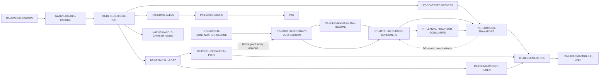

# Recursive-descent retirement — the B2F migration, finished

**Operator directive, 2026-07-29:** *"Prioritize replacement of RecursiveDescent.
Create WPs to migrate the remaining residual classes and schedule them. Again,
this is a crucial efficiency issue we should close and we should not let it
linger in a half-migrated state. That just carries tech debt for no benefit."*

> ### OPERATOR RULING, 2026-08-15: `RecursiveDescent` IS NOT THE ORACLE
>
> > `RecursiveDescent` should not be taken as de facto spec. It was a failed
> > implementation attempt that needs to be replaced. The key oracle is not
> > `RecursiveDescent`, but the interpreter.
>
> **This governs every parity and narrowing argument in this campaign.** Where a
> row is described as *"compiles under `RecursiveDescent` and refuses under
> `FunctionizedUnits`"*, that disagreement is still a defect — local dispatch
> machinery may not affect program-observable results — but **which side is wrong
> is settled by the interpreter, not by which one compiles.**
>
> ⇒ **`RecursiveDescent` behaviour is not a capability to preserve.** A row it
> accepts and the interpreter rejects is an over-acceptance to drop. A row it
> accepts and the interpreter runs is an obligation on `FunctionizedUnits`.
>
> **Do not read parity runs as the acceptance bar.** `rt_parity_native` compares
> two backends to each other; it cannot tell you which one matches the oracle.
> It remains a useful regression net and is not a specification.

**This campaign closes a migration the code itself calls temporary.**
`select_body_emission_authority` is documented as *"The one **temporary** B2F
migration selector"* (`lowering/core.rs:174`). It has been temporary long enough
to grow a per-function code-size wall on the lane it was supposed to be
retiring.

> ### INDEPENDENTLY CORROBORATED — the Architect reached the same conclusion from a different direction
>
> The §5a **12th-entry predicate check** (`evt_6vw2j1c5sqzka`, 2026-07-29)
> partitioned twelve hard stops and found **no single shared predicate** — but it
> named, as one of five subfamilies covering **entries 4–6 and the port aspect of
> entry 11**:
>
> > *"executable-boundary closure is incomplete. A static identity or semantic
> > seat exists, but the `FunctionizedUnits` selector, carrier, consumer, join, or
> > callable-declaration port cannot transport it through complete emission."*
>
> ⇒ **That is this campaign's subject, arrived at by partitioning the failure
> history rather than from the directive.** The campaign's grounding is therefore
> two independent sources — the operator's directive and the Architect's
> partition — not one. It does **not** authorize a representation recut; the
> predicate answer was `independent/mixed` and every proved subfamily keeps its
> own routed repair.

---

## 1. What the selector actually does

```rust
if recursive_descent_residual(expr)
    .or_else(|| declarations.values().find_map(declaration_recursive_descent_residual))
    .is_some()
{ BodyEmissionAuthority::RecursiveDescent } else { BodyEmissionAuthority::FunctionizedUnits }
```

**Whole-program and all-or-nothing.** *Any* retained residual anywhere in an
object routes the **entire object** to the monolithic `RecursiveDescent` root,
where declaration bodies are recursively lowered *into* one generated function
rather than reached as separately owned callable units.

⇒ That root is what exceeds Cranelift's per-function ceiling
(`Compilation error: Code for function is too large`), and it is the efficiency
cost this campaign exists to remove.

## 2. The five residual classes and who owns each

| class (`core.rs:41-57`) | what it is | node |
|---|---|---|
| `TransparentDeclarationClosure` | a transparent declaration whose body is a closure seed | [`RT-DECL-CLOSURE-PORT`](issues/RT-DECL-CLOSURE-PORT.md) |
| `SeedClosureCall` | a `Call` whose **callee** is the retained non-lexical closure form | [`RT-SEED-CALL-PORT`](issues/RT-SEED-CALL-PORT.md) |
| `ProducerMatchCall` | an ordinary producer `Match` whose scrutinee is directly a `Call` | [`RT-PRODUCER-MATCH-PORT`](issues/RT-PRODUCER-MATCH-PORT.md) |
| `MatchScrutineeRecursor` | an ordinary `Match` consuming an **active computational recursor** | [`RT-RECURSOR-TRANSPORT`](issues/RT-RECURSOR-TRANSPORT.md) |
| `LexicalCallArgumentRecursor` | a lexical unit call whose **argument** is an active computational recursor | ← *same node* |
| — | delete the selector, the enum, the authority, and the lane | [`RT-DESCENT-RETIRE`](issues/RT-DESCENT-RETIRE.md) |

### Why two classes share one node, and one does not

**`MatchScrutineeRecursor` and `LexicalCallArgumentRecursor` are one mechanism in
two syntactic positions.** The code says so itself, in
`LexicalCallArgumentRecursor`'s own doc comment:

> *"The recursive result still carries invocation-local scope/return-hole state.
> Passing it through a separately declared lexical unit is not one of the
> completed functionized ports."*

Both classes fire on an **active computational recursor** — a
`ComputationalMatch` with a case carrying non-empty `recursive_positions` — whose
result carries invocation-local scope/return-hole state across a boundary. One
occupies a match scrutinee, the other a lexical call argument. ⇒ **Retiring one
without the other would build the transport twice.** They are folded, per
`docs/PRINCIPLES.md` *subsume-don't-proliferate*.

**`SeedClosureCall` is deliberately NOT folded into
[`RT-DECL-CLOSURE-PORT`](issues/RT-DECL-CLOSURE-PORT.md), even though it is
close.** Both concern closure seeds becoming callable units, and
`RT-DECL-CLOSURE-PORT`'s `D2`/`D3`/`D4` build exactly that machinery — so
`SeedClosureCall` may turn out to be **largely or wholly subsumed**. That is a
*prediction, not a measurement*, and folding on an unmeasured prediction is the
error that held a ring for a day on 2026-07-28. `RT-SEED-CALL-PORT` therefore
exists as its own node whose **`D1` may legitimately return "already retired"**,
at which point it closes for free. A node that closes cheaply on evidence is
correct; a fold that was wrong is expensive.

## 3. THE CAMPAIGN'S BINDING TRAPS — EVERY ONE BINDS EVERY NODE

The first two follow from one fact: **the selector short-circuits at the first
residual it finds**, consulting the expression walk before the declaration walk.

### Trap 1 — you cannot measure your own class while an earlier class fires

`recursive_descent_residual` returns `Option<_>` and every combinator is
`.or_else(...)`. So a program that fires *your* class and also an earlier one
reports only the earlier one. ⇒ **You cannot enumerate your class's real
population by reading what the selector reports.**

**Consequence, and it is a hard requirement:** every node's `D1` must
enumerate **every** residual firing on the measured programs, not the
short-circuited first. This is the same `D1` obligation
`RT-DECL-CLOSURE-PORT` already carries; the enumeration should be built **once**
by whichever node runs first and reused, not rebuilt per node.

**IT HAS BEEN BUILT. REUSE IT — do not build a second one.** Measured at
`origin/main = 606efa93` (2026-08-08), landed by `RT-SRCBODY-BIND-ORDER`
(`7ca5cfc0`):

| what | where |
|---|---|
| entry point, over expression plus declaration map | `lowering/core.rs:598` `enumerate_recursive_descent_residuals` |
| non-short-circuiting walk, `BTreeSet`, no wildcard arm | `core.rs:616` `collect_recursive_descent_residuals` |
| exact-set control, `assert_eq!` over four variants | `core/tests/control.rs:10849` `d1_the_enumerator_reports_every_variant_not_the_first` |

**Two standing obligations survive its existence, and they are what each `D1`
still owes.** First, **run the control by name on your tree** — later
deliverables rewrite `core.rs` underneath it, so presence is not greenness.
Second, **an instrument that can see a class is not a population**: the
committed witnesses are hand-built `RuntimeExpr` values in tests, not Ken
programs, so they prove the walk reports the class and say nothing about
whether any real program fires it.

**`RT-SEED-CALL-PORT` asserted this instrument did not exist until 2026-08-08**,
having inherited that fact from `RT-DECL-CLOSURE-PORT` — where it was true — and
never re-derived it after a later node landed one. **Re-derive a claim about the
tree against current `main` at each use.**

### Trap 2 — the later nodes are riskier than they look

As classes retire, program shapes that **never reached `FunctionizedUnits`
before** begin to. Those shapes have never been emitted on that lane, never been
scale-measured on it, and never exercised its invariants.

**This is not hypothetical — it already happened once.** Hard stop #21
(`NATIVE-HANDLE-CARRIER`, 2026-07-29) was the *first program shape* to violate a
fail-closed join-accounting invariant that `RT-FNSPLIT-RECUR-PORT` had landed
green, producing [`RT-JOIN-DISPOSITION`](issues/RT-JOIN-DISPOSITION.md). ⇒
**Expect one such stop per class retired, and do not price the later nodes as if
the earlier ones de-risked them.** They enlarge the exposed population instead.

**Do not treat a hard stop in this campaign as a defect in the node that
found it.** It is the fail-closed machinery doing its job on a newly reachable
population. Route it; do not work around it.

#### AND THE OBVIOUS `AC-1` CANNOT SEE IT

**Every node's `AC-1` quantifies over the programs that FIRE its class. This
trap's population is the COMPLEMENT of that set.** The rows that break never
fired your class at all — they were already green, and your port newly routes
them onto `FunctionizedUnits`. ⇒ An `AC-1` of the form *"every program `D1`
named as firing this class compiles and passes"* is **structurally blind to the
hazard described above**, and reads green while the port regresses `main`.

**Measured 2026-07-29 on [`RT-DECL-CLOSURE-PORT`](wp/RT-DECL-CLOSURE-PORT.md).**
It discharged its selector gate on both governed deltas
(`authority=FunctionizedUnits`, `residuals=none`) — the size wall was genuinely
gone. A **delta-free** baseline then returned **1/7**: five rows green on `main`
hit a carried-scrutinee producer-`Match` refusal, and a sixth hit a distinct
closure-capture refusal. **The port was not additive — it regressed `main`.**
Every prior measurement had carried a delta, so the regression set was invisible
to all of them.

⇒ **Two obligations on every remaining port node in this campaign:**

- **`D0` — run the target suite on the base with NO delta applied**, before
  building, and record which rows are green. That set is the regression
  baseline. A measurement carrying your own delta structurally cannot produce
  it.
- **Factor `AC-1` in two**, because one criterion cannot carry both claims:
  - **`AC-1a` — the ceiling moved.** The selector reports
    `authority=FunctionizedUnits` / `residuals=none` on the governed programs.
  - **`AC-1b` — the objects still build.** Every row green in `D0` is still
    green. This is the criterion that catches the regression, and it is
    **not** discharged by `AC-1a`.

**CI does catch this** — `rt_parity_native` has run as its own job since
2026-07-22. But it catches it *after* a QA cycle and a full CI run, on a
candidate already cut. `D0` costs one suite run before any code is written.

### Trap 3 — a proof over an incomplete population is vacuous

**Measured 2026-07-29, and it rejected a candidate that was otherwise sound.**
`RT-JOIN-DISPOSITION`'s `27f9dca2` built a completed-CFG *materialized-but-dead*
proof — entry reachability, live predecessor input, reachable block-param use —
quantified over `materialized_join_blocks`. One production site
(`lower_dynamic_host_result_match`) created a **real** planned CLIF merge and
appended its parameters **directly**, bypassing `append_planned_join_params`.

⇒ That block was never recorded, so for the whole HostResult class the proof ran
over an **empty list and passed**. A real merge would have been classified
"metadata-only materialization," and all three CFG obligations were **vacuous**.
Architect ruling `evt_24esnraje522r`.

**The shape generalizes past that node, and this campaign is full of
population-quantified proofs** — residual enumerations, reached-case unions,
materialized-block sets, and [`RT-DESCENT-RETIRE`](issues/RT-DESCENT-RETIRE.md)'s
"no residual fires anywhere."

**So whenever a node adds a proof over a population, the paired obligation is
a control that REDS WHEN A MEMBER IS OMITTED FROM THE POPULATION** — not merely
one that passes when the proof holds. The sound-proof-over-incomplete-population
failure is silent by construction: **every control over it passes**, which is
exactly why it survives review.

### Trap 4 — a red CI job is not evidence that the atomic set is too small

**Measured 2026-07-30, and it nearly re-scoped two nodes for nothing.** The
`RT-DECL-CLOSURE-PORT` `D7` + `RT-RECURSOR-TRANSPORT` atomic candidate reached CI
as PR #1251 and came back **8 of 12 red**, against a `main` that was **12 of 12
green** — so the failures were genuinely the lineage's, not inherited. Two of the
refusals named shapes that *look* like later nodes' territory, and the
`RT-DECL-CLOSURE-PORT` frame itself already said `AC-4` was *"unreachable until
its consumers are complete."* ⇒ The obvious reading was **fold the successors in
and land a bigger set.**

**That reading was wrong.** Architect `evt_21gpwrsewyxax`: CI falsified **that
SHA's sufficiency, not the node partition.** Both refusal classes were in-scope
defects of the pair — a capture contract projected down to `capture_count`, and a
`#26` population omission falling through to a late generic refusal.

**THE TEST, and it binds every node in this campaign:**

> **A node joins an atomic landing only when a failure fires THAT NODE'S OWN
> PRODUCING PREDICATE.**

For the two remaining syntactic residuals that means, concretely:

| node | its producing predicate |
|---|---|
| [`RT-SEED-CALL-PORT`](wp/RT-SEED-CALL-PORT.md) | a `Call` whose callee is the retained non-lexical closure form |
| [`RT-PRODUCER-MATCH-PORT`](wp/RT-PRODUCER-MATCH-PORT.md) | an ordinary producer `Match` whose scrutinee is directly a `Call` |

**A test name is not ownership, and neither is a pre-port refusal text.** Both
mislead in the same direction here: a row that failed at the base with one
refusal can reach a *different* wall after the port, and the base text then names
the wrong owner. ⇒ Attribute by **the predicate the failure actually fires on the
candidate**, which means the per-row **first-refusal map** Trap 2 already
requires — never the aggregate, never the test name.

**And the reason this trap is expensive rather than merely wrong:** widening an
atomic set is nearly irreversible in practice. It lengthens the critical path,
re-opens settled frames, and every node in front of the widened set compounds.
Reading a red job as a partition defect spends that cost to fix an implementation
bug.

### Trap 5 — preflight follows a synthesized aggregate

**Architect ruling `evt_1zq4fkh6a1jv5`**, generalizing the defect that rejected
`dec_pg3yyzhx085j` (`evt_3qywmvj31e7y9`). **The scope is the allocation
mechanism, not a node name** — `RT-DECL-CLOSURE-PORT`'s worker environment was
the *witness*, never the boundary.

> **Trap 5 — preflight follows a synthesized aggregate, not a node or
> callable-unit name.** Creating or calling a separately emitted unit does not by
> itself create a capture-environment aggregate. But whenever a remaining node
> synthesizes a `Constructor` or `Record` environment, planning must, before any
> allocation or publication, issue one exact occurrence record keyed by the exact
> callable/environment owner identity and phase, aggregate identity/class/arity,
> and ordered child provenance; close the possible referent-owner set of every
> transitive child; select `PersistentGround` only when every possible child is
> immediate or persistent and `InvocationAggregate` when any possible child is
> invocation-owned; and reject every forbidden, unrepresented, or protocol-only
> child. Lowering consumes the move-only exact occurrence authority before
> allocation and does not rediscover ownership. The existing escape guard remains
> defense in depth. If the port allocates no aggregate, record that fact; do not
> mint an artificial environment or token merely because a callable unit exists.

**Why this is not new law.** `RT-DECL-CLOSURE-PORT.md:1290-1311` already requires
an exact planner-issued occurrence record for **each** `Constructor` or `Record`
occurrence. The `7b860005` worker environment was one new `Record` allocation
site that **bypassed** that existing law.

**And why a blanket "one environment token per callable unit" would be FALSE.**
At exact `6b9fe2bf` two FunctionizedUnits paths create and call units while
allocating no capture `Record` at all: the direct lexical-closure call builds an
ordered `args + captures` ABI-input vector and calls the declared unit
(`core.rs:7281-7317`), and the ordinary lowered-closure call extends `call_env`
with captures and calls the unit (`:7344-7395`). ⇒ A per-unit token would
manufacture state the mechanism does not need.

**What binds each remaining node:**

| node | what binds |
|---|---|
| [`RT-SEED-CALL-PORT`](wp/RT-SEED-CALL-PORT.md) · [`RT-PRODUCER-MATCH-PORT`](wp/RT-PRODUCER-MATCH-PORT.md) | If the lawful port is only typed parameter/capture/result transport and allocates no aggregate, the obligation is **vacuous — record that fact.** If either port synthesizes a `Constructor`/`Record` capture environment, the complete preflight / owner-meet / exact-token law binds that site **before its first allocation.** |
| [`RT-DESCENT-RETIRE`](wp/RT-DESCENT-RETIRE.md) | A **deletion** node, not authorized to invent a new environment. It must preserve every surviving FunctionizedUnits allocation law. If deleting the old lane **exposes** a synthesized aggregate site that lacks the law, that is a **hard stop** — not permission to delete around it. |

**This is a framing invariant, not a new AC**, and it authorizes no change to
any active repair.

## 4. Schedule

Runtime is single-threaded, and **every node here edits `lowering/core.rs`**, so
this is a strict sequence, not a fan-out.

> ### CORRECTED 2026-07-29 — `PX8` IS **NOT** RELEASED AT #3
>
> **STATUS 2026-08-08: this block is now a record. Every gate it names has
> merged** — `RT-DECL-CLOSURE-PORT` (#3, carrying `D7`) and
> `RT-PRODUCER-MATCH-PORT`, to which it moved the ABI release gate, are both
> `merged`. Its surviving lesson is the last paragraph, which still binds. Note
> that `D7` did **not** in the end land atomically with anything; the atomic-pair
> plan described further down this document is withdrawn — see the
> non-operative-history fence.
>
> **#3 absorbs a consumer-matrix deliverable instead.**
>
> This section previously claimed *"`PX8` is released at #3… Foundation resumes
> in parallel from #4 onward and this campaign does not hold it."* **That was
> measured false on 2026-07-29** and the corrected schedule is below.
>
> `RT-DECL-CLOSURE-PORT` did exactly what it promised — **both** governed deltas
> now report `authority=FunctionizedUnits`, `residuals=none`
> (`evt_69ebt7hwg8508`). But the rows `PX8-ERRID-ALLOC` and
> `NATIVE-HANDLE-CARRIER` must *compile* then hit a **newly reachable**
> `FunctionizedUnits` refusal — `ComputationalMatch: tree-producing match
> scrutinee is not Bool or a constructor` — which the Architect filed under
> **`RT-PRODUCER-MATCH-PORT`** (`evt_5catd48dv8db6`, hard stop #22).
> ⇒ **The ABI release gate moved from #3 to `RT-PRODUCER-MATCH-PORT`.**
>
> **THE MATRIX RULING (`evt_6h6vzqw7ydra8`) SUPERSEDED PER-CELL OWNERSHIP.**
> The repair is **one closed `Carried`-consumer matrix**, added to **#3** as
> `D7`, and it **lands atomically with `483ef7ab`**. **The two observed
> refusals are NOT separate nodes**, and #4/#5 are **not** reordered — they keep
> their syntactic residual retirements and gain nothing here.
>
> **Why no node could be split off:** #3 alone regresses existing green rows; a
> consumer node cannot merge first with a reaching production witness; and #3
> cannot merge first. ⇒ **A nominal node with no independent safe merge
> boundary is a label, not a node.** So the ABI release is **#3's own merge**,
> now carrying `D7`.
>
> **The lesson, since this is the second time it bit in two days:** the false
> claim was not a measurement error — it was a **scope inference** ("the ABI
> campaign needs `TransparentDeclarationClosure` retired **and nothing more**")
> written as if measured. The identical shape held Foundation for a day on
> 2026-07-28. A release edge asserted from scope reasoning is not a release
> edge until a row compiles.



| # | node | size | why here |
|---|---|---|---|
| 1 | `RT-JOIN-DISPOSITION` | M | merged; repaired the phase invariant the whole campaign kept hitting |
| 2 | `NATIVE-HANDLE-CARRIER` | M | **held at `85dcee25`** — reached #3's ceiling; resumes on #3's merge |
| 3 | `RT-DECL-CLOSURE-PORT` | **L+** | **builds the closure-seed → callable-unit machinery** #4/#5 reuse. mechanism gate discharged on **both** deltas. **Now also carries `D7`, the closed `Carried`-consumer matrix, and holds the ABI release** |
| 4 | `RT-SEED-CALL-PORT` | S–M | cheapest; reuses #3 directly and may close on its own `D1` |
| 5 | `RT-PRODUCER-MATCH-PORT` | M | its **syntactic** `ProducerMatchCall` retirement only — **not** the carried-`Match` transport, which is #3's `D7` |
| 6b | `RT-RECURSOR-TRANSPORT` | **M, provisional** | **RECUT 2026-08-08** (Architect `evt_237tbdsacqbk4`). The atomic-with-#3 assembly and the `size: L` are **withdrawn** — `D7` merged on its own, and the continuation machinery the `L` assumed this node must invent has landed. Now: re-census, one discriminating executable witness per live position, then only the narrow consumer port each failure proves necessary. Branches from post-`RT-CONTSPEC-WITNESS` `main`; `07ce6ef1` is **not** its base. Outcome **(b)** still holds |
| 6c | `RT-MATCH-RECURSOR-CONSUMERS` | **M, provisional** | **Trap 2 again, filed 2026-08-08** (Architect partition `evt_3r4j14fv1jtj2` on census `evt_16cmej481q7ns`). Owns **row 6 (`d8d`)** and **completion of Position A**. `d8d` enumerates exactly `{MatchScrutineeRecursor}`; **A**-only exclusion reaches `FunctionizedUnits` and refuses on `RecursiveBackedge`. **Its refusal reproduces at exact `D2` `8efdfdb3` with production still on `RecursiveDescent`** — so it is a `D2` **completeness defect**, not a `D3` artifact. Goes **first** of the two, because it closes the Position-A claim the `D2` record correction narrows. `RecursiveBackedge` stays protocol-only; the repair consumes the protocol at its owner before the value boundary |
| 6d | `RT-LEXICAL-RECURSOR-CONSUMERS` | **M, provisional** | Same routing event; **rows 1-5 only, eight expressions across five test families**, each enumerating exactly `{LexicalCallArgumentRecursor}`. **B**-only exclusion is its proven activation seam. Filed `draft` with a written frame, released the moment #6c merges — the order is ruled, not technical. **Do not fold #6c and #6d together**: distinct producer, hook, boundary and completion owner; a shared root would be a subsumption proposal routed before coding, never inferred from shared timing or syntax |
| 6e | `RT-CARRIED-CONTINUATION-RESUME` | **M — MERGED 2026-08-08** (#1623 + #1625, all four deliverables, all eight of its own ACs met; the `AC-1` called undischarged in its thread is #6c's, not its own) | **Trap 2 a THIRD time, filed 2026-08-08** (Architect sibling-authority ruling `evt_2pt95vbja6447`). **#6c's `D2` worked** — it repaired `carried_join_arm` by mirroring how the scalar lane already represents a backedge arm, built no new control flow, and the `RecursiveBackedge` refusal is **gone from both A rows**, which is itself the proof the arm was reached. Both rows then fail further in at a **sibling authority**: `lower_computational_match_value_composed`, refusing `BoundaryCarrier`. **Not** a defect in either landed port — `resume_active_continuation` takes `Specialized(RecursiveBackedge)` with no value to resume and the CFG edge already gone; this arm takes `Carried(word)`, a **live dynamic value**, with a `PendingLet`/`Active` first eliminator. A pending suffix is shared **context, not shared authority**. Population is the production arm `Carried(word)` x `{PendingLet, Active}`; the two exposed rows are its floor. **`D0`/`D1` must partition the two frame variants before coding** — a shared refusal arm is not evidence they need one mechanism. **Gates #6c's `AC-1`**; does not reopen #6b's `D2` |
| 6f | `RT-CARRIED-ORDINARY-COMPOSITION` | **S — MERGED 2026-08-08** (#1635 `D2` accepted partial at exact `1f89a92b`, #1637 `D3` at exact `fcf5ce23`; re-sized M to S on the `D0`/`D1` census). All four deliverables in. **`D3` is worth reading for its own reason:** it was armed not to key on the *fifth* wall's refusal string, and found the `D2` refusal fails the opposite way — **`D2` deleted it from production**, so `!contains(D2_refusal)` is true for free and would keep passing if the repair were removed entirely. The control instead keys on a non-zero pre-guard denominator plus `continuations == arrivals` as **equality**, with a mutation that makes the pre-`D2` sentence producible again. **No row closes and #6c's `AC-1` stays open** — both A rows stop at the fifth authority, routed to #6g | **Trap 2 a FOURTH time, filed 2026-08-08** (Architect fourth-wall ruling `evt_63ae56tttz9pq`). **#6e's `D2` worked** — routing `Carried x Active` into the phase-agnostic `resume_active_continuation` advanced both A rows, and the backtrace **measured** that the carrier survives the composition rather than inferring it from the signature. Both rows then fail at the `Carried x Ordinary` **pre-delegation guard family**: the carried elimination consumes exactly one frame, so a composed suffix behind it is refused rather than silently dropped. **A completeness successor to #5, not a defect in it** — `RT-PRODUCER-MATCH-PORT` `D2` documented all three of these guards in code, said retirement would make them live for the first time, and said plainly they had **no shape-reaching control**. One now has a shape reaching it, and the author's prediction was accurate. Population is the whole guard family — retained scrutinee index, deferred constructor case, nonempty `eliminators[1..]` — **with intersections**, because the guards are ordered and only the first reached is observable. **Two suffix sources must not be conflated**: #6e's own new outer-tail guard did **not** fire; the firing tail is the successor frame rebuilt from `active.pending`. **Gates #6c's `AC-1`** |
| 6g | `RT-SPECIALIZED-ACTIVE-RESUME` | **S — `D2`/`D3` ACCEPTED PARTIAL 2026-08-08** at exact `d9175d05` (Architect `evt_vxqa83y4z3nt`, Steward `evt_27jwdbz9h2t4c`); re-sized M to S on the `D0`/`D1` census. **Not yet merged** — a documentation-only scope child is owed first, because the handback stated `+417/-16` against the `D0`/`D1` checkpoint `f3be6476` while the cut from base `dcd6d84c` is `+664/-6`; both anchored ranges must be stated. **The node does NOT close and #6c's `AC-1` stays open.** **The cross-crate census was TAKEN and retires a question the campaign carried for five nodes:** the instrument *does* reach `ken-cli`/`ken-verify` (proven with a positive control), but `SELECTOR_VARIANT_EXCLUSION` and the activation seam are `#[cfg(test)]`, so those binaries build `ken-runtime` without them and **a cross-crate census can only ever witness the RETAINED lane**. **Trap 1 is therefore not closable by measurement here** — closing it would mean moving a test-only seam into production gating. **Do not re-run this census.** The `--include-ignored` run splits a question previously carried as one: the sole failure is `RT-COMPMATCH-TREE-SCRUTINEE`, a **real-program** non-constructor scrutinee in this wall's class failing at a *different* consumer — so the class **does** occur in real programs, and what is `cfg(test)`-only is this specific cell. **`coc_d3`'s mutated denominator was corrected** from `mutated_arrivals == arrivals` to `> 0`: the equality held only because both runs aborted at the same downstream wall, so once lowering lawfully continues, equality asserts the repair has no downstream effect. `continuations == arrivals` and `mutated_continuations == 0` are untouched | **Trap 2 a FIFTH time, filed 2026-08-08** (Architect sibling-authority ruling `evt_1pw1ng8448mef`). **#6f's `D2` worked** — the suffix continuation landed with `lower_carried_match`'s interface untouched, a stated lexicographic measure on `(active.pending.len(), eliminators.len())` and an independently enforced fail-closed depth bound; the trailing-suffix refusal is **gone from both A rows**. **This is the first wall on the chain that is NOT a carrier problem** — the carrier has already been eliminated. Both rows now fail at `lower_computational_match_value_composed`'s `Lowered::Constructor` destructure, which **sits before the eliminator dispatch**, so an `Active` frame never reaches its resume when the value is an ordinary non-constructor. **Constructor shape is necessary for `Computational` and `Ordinary` elimination and is NOT a prerequisite for resuming `Active`** — producer and bounded/structural-Nat paths already resume `Active` over a `LoweringOperand` without it. Measured on evidence-only `aa78c973`, identical index-for-index across both rows: the carried ordinary elimination **completes**, returns `Specialized(ProcessExitStatus)`, the remaining stack is exactly `[Active]`, and `resume_active_continuation` **has not entered**. `D1` partitions at least five classes; **`RecursiveBackedge` must propagate and `Trap` must seal — do NOT hoist `Active` dispatch above the shape and terminal guards.** The exact refusal is **pinned in full equality** by a committed suppression control, so a message change reds it **by design** — and that control's continued discrimination is the free check that no protocol machinery leaked into the resume path. **Gates #6c's `AC-1`** |
| 6h | `RT-CONTINUATION-CALL-DISCHARGE` | **ATTRIBUTION DELIVERED; `D2`/`D3` WITHDRAWN to #6i, 2026-08-08** (Architect hard-stop `evt_dakdkqk4wbg6`). **The exact-witness conclusion "no call occurred" STANDS**, option 2 stays refuted, and the 213-identity census stands. **Option 3 is NOT implementable as planner-side edge exclusion:** one planner edge carries **both** binding projection **and** the causal call obligation, and bridge selection cannot distinguish them — 34 bridge-taken edges are genuinely composed, and the ruled witness shares **identical planner coordinates** with `d8e`. Both narrowings are **real failures**: removing the edge before interning loses the binding so `d8e` compiles with a shifted environment; removing only `calls.insert` leaves an interned-unit/caller population contradiction. Green partial `2e267180dcbdb7a5` (the `D0`/`D1` record) proceeds through fresh exact-SHA QA and a Decision **excluding all `D2`/`D3` mechanism**. Held `a15a3e934766a1d0` carries a **committed red control by design — never published**; the `a15a3e93bd76...` string that circulated is **NOT AN OBJECT** and shares its first eight characters. **Sizing RETIRED, not corrected** — `S` was granted against a repair that no longer exists. Originally released as: **M provisional — RELEASED 2026-08-08**, frame at `docs/program/wp/RT-CONTINUATION-CALL-DISCHARGE.md`; base is `main` after #6g's partial lands, pinned in the first checkpoint post. **Sizing is expected to move on `D0`/`D1`**, because the three classifications differ by more than a size step. **Runtime must not begin it until the Steward releases it** (Architect, `evt_vxqa83y4z3nt`) | **Trap 2 a SIXTH time, and the FIRST planner-population authority on this chain.** #6g's `D2` cleared the fifth wall, so `ContinuationClaimLedger::close` became reachable for this shape **for the first time** and refuses: **one planned causal token is neither directly emitted nor compositionally consumed**. The law is **exact set equality** — `planned = direct-emitted ⊎ composed-consumed`, sets not counts — and `close` separately refuses an identity in **both**. Every measured member has `pending_len=0`, where `resume_active_continuation` returns its operand unchanged, so the activated path reaches an empty `Active` resume **with no call** while the planner has already minted one. **That proves a planner/lowering obligation mismatch and does NOT say which side is wrong.** **This is an ATTRIBUTION node — it does not begin with a repair.** `D1` classifies exactly one of three, refuting the other two: a real direct obligation was skipped; a real composed consumption occurred but its evidence was lost; or the activated path has no causal call obligation and the planner's issuance/projection is wrong at planner authority. **`pending_len == 0` alone establishes none of them.** **Architect-forbidden, all four:** discharging the token in the empty resume, weakening the law or the both-sets refusal, bulk-claiming the token, and manufacturing a composed discharge or treating an identity return as a call. **The retained lane is the control** — it closes the same program, so whether the same identity is discharged directly or compositionally there is the discriminator, and it is free because both lanes already run. **Option 3 is not a free relabelling:** `open` records that `planned == resolved` is *structural today*, so a projection correction **moves the set `close` checks against**. Held lane-pair evidence `65639a13` is **evidence, never a candidate — do not publish it** — and becomes this node's end-state acceptance control. **Gates #6c's `AC-1`** | **Trap 2 a FIFTH time, filed 2026-08-08** (Architect sibling-authority ruling `evt_1pw1ng8448mef`). **#6f's `D2` worked** — the suffix continuation landed with `lower_carried_match`'s interface untouched, a stated lexicographic measure on `(active.pending.len(), eliminators.len())` and an independently enforced fail-closed depth bound; the trailing-suffix refusal is **gone from both A rows**. **This is the first wall on the chain that is NOT a carrier problem** — the carrier has already been eliminated. Both rows now fail at `lower_computational_match_value_composed`'s `Lowered::Constructor` destructure, which **sits before the eliminator dispatch**, so an `Active` frame never reaches its resume when the value is an ordinary non-constructor. **Constructor shape is necessary for `Computational` and `Ordinary` elimination and is NOT a prerequisite for resuming `Active`** — producer and bounded/structural-Nat paths already resume `Active` over a `LoweringOperand` without it. Measured on evidence-only `aa78c973`, identical index-for-index across both rows: the carried ordinary elimination **completes**, returns `Specialized(ProcessExitStatus)`, the remaining stack is exactly `[Active]`, and `resume_active_continuation` **has not entered**. `D1` partitions at least five classes; **`RecursiveBackedge` must propagate and `Trap` must seal — do NOT hoist `Active` dispatch above the shape and terminal guards.** The exact refusal is **pinned in full equality** by a committed suppression control, so a message change reds it **by design** — and that control's continued discrimination is the free check that no protocol machinery leaked into the resume path. **Gates #6c's `AC-1`** |
| 6i | `RT-CONTINUATION-EDGE-DISPOSITION` | **M — `D0` AND `D1` MERGED 2026-08-09.** `D1` at exact `fbc49ddd` (PR #1667, CI green, base `71646eb1`, seven paths `+623/-4`, blob identity verified on all seven, Adversary notified): the **sibling candidate ledger** at the same artifact boundary as the claim ledger, keyed from the same `ContinuationCallIdentity` projection, with three bounded settlement seats — `DirectCall` after claim/emit, `ComposedCall` after the existing verified-feed double-discharge refusal, `InlineNoCall` after an `Ok` bridge result while neither settled nor pending-composed. **Dispositions only: no totality check, no subset derivation.** **Its `AC-7` witness REFUSES and the exact string is the discriminator** — a green result would mean `D2` done early, a weakened equality, or the withdrawn planner-side exclusion returning, so a control keyed on "it failed" would pass under all three while this one passes under none. **Held `652df2ea` and `487a06cc` are SUPERSEDED and `a504aa96` never publishable.** **`D2`/`D3` REMAIN STOPPED.** Size settled at **M** on the census plus the `D1` cut. `D0` merged earlier at exact `e93afb06` (PR #1659, record only, `crates/` byte-identical to base `6be73d20`); framed and released 2026-08-08. **`D1`/`D2`/`D3` are STOPPED**, now under Architect ruling `evt_40rf074xsj3y1` rather than awaiting one. **Still no size, and none was proposed. Do NOT inherit #6h's `S`** — that size was granted against an edge-exclusion repair the ruling withdrew. **The census stands:** the population **does** partition — 637 candidates, one disposition each, zero orphans (`DIRECT` 193, `COMPOSED` 43, `BOTH` **0**, `INLINE_NO_CALL` 21, `BRIDGE_INCOMPLETE` 25, `PLANNED_ONLY` 355) — and **637 is retained as the observational superpopulation**. **THE 210-of-637 RESULT IS NOT A SECOND HARD STOP, and the campaign carried that inference for one merge window before it was corrected.** There is **no per-owner closeout**: one artifact-wide ledger opens in the selected `FunctionizedUnits` arm before `define_unit_bodies`, is seeded from the plan's full `continuation_calls()`, and closes only after every definition pass and the root adapter succeed. ⇒ `CLOSE_CHECKED = false` means **that compile never reached a successful functionized-artifact closure, or selected another authority** — **not** that a healthy candidate lay outside a successful closeout's authority; the 52 `DIRECT` and 11 `COMPOSED` rows are census observations, not omitted members. **`D2`'s quantifier is narrower and exact:** every activated binding candidate in **one selected `FunctionizedUnits` artifact**, settled once before that artifact closes — plan-only rows, `Err` compilations, and non-selected `RecursiveDescent` plans **are not obligations**. The candidate layer shares the ledger's artifact lifetime and does **not** widen it, add a per-owner close, or traverse failed compilations. **`AC-7` is SPLIT ACROSS `D1` AND `D2`** (ruling `evt_5n735c2e9r52k`): `D1` owes a real **REFUSING** witness pinning selection, binding installation, disposition settlement and close arrival, and **must not claim compile-OK** — because `open` seeds `planned` from the full `plan.continuation_calls()` projection and the unchanged `close` requires `planned = emitted ∪ composed`, so a genuine `InlineNoCall` candidate is in the first set and in neither discharge set; `D2` converts that **same** witness to compile-OK after total/disjoint disposition close and subset derivation; `D3` consumes the post-`D2` successful witness and **no `D3` control may substitute `D1`'s refusal for `D2`'s success**. **A phase correction, not a weakening** — the final bar is still a real binding-installed, closeout-checked, compile-OK member. **`AC-7` is measured OPEN, and it is the WITNESS CELL that is empty, not the class** — `D0` measured **21** members; what is empty is `binding-installed ∩ closeout-checked ∩ compile-OK`. The three closeout-visible members are this campaign's own controls (`ccr_d3`, `coc_d3`, `sar_d3`), all refusing, and the two in successful compiles carry `CLOSE_CHECKED = false`, so they compile **because nothing looked** — counting those is **Trap 3** exactly, and the witness must be **authored under `D1`**. **The §4 stop is UNFIRED AT `D0`** — verbatim: `UNFIRED AT D0; re-route only if D1 changes unit population, declaration, definition, ABI projection, or traversal.` **`D0` owes nothing further on this axis and no direct ABI probe is to be re-run.** `px8j` is **non-selected**, measured with a same-run probe-alive control, so its `b2f_last_unit_emission() == (0,0)` is a non-selected-authority result rather than a blind instrument; the **selected-side reachability controls are `sar_d3`, `ccr_d3` and `coc_d3`**. **Unfired is not cleared** — the condition was evaluated and did not hold, so it stays live as a `D1` obligation on the five named axes. **The predicted failure shape did not occur** — the population partitions cleanly, and the open question is reachability of one target, not the shape of the population. | **The SEVENTH wall, and the first whose deliverable is a REPRESENTATION SPLIT rather than a correction.** The planner mints an opaque **binding candidate** carrying exact worker provenance and selector: it authorizes environment installation but **does not assert a causal call**. Lowering settles each candidate **exactly once** — `DirectCall` at the verified direct producer/call seat; `ComposedCall` only after the raw-worker call is emitted **and enters finished-CLIF verification**; `InlineNoCall` only after the exact deferred bridge scope **completes successfully** with the candidate still unconsumed. A static-worker binding carries candidate authority; source-machine consumption promotes it to `ComposedCall`, while a **value-position read still reaches the fail-closed `StaticWorkerBinding` guard**, so `d8e` keeps binding count 1 and refuses. Closeout requires an exact, **disjoint** disposition for every candidate, then derives the call-obligation subset from `DirectCall ∪ ComposedCall` and applies the existing law **unchanged**. **`InlineNoCall` is NEVER a discharge and never enters that equality** — this is deliberately **not** a third discharge form, which would falsify the ledger's meaning; the layer sits **in front of** the unchanged partition. **Measurements before mechanism:** census the full candidate/unit population by installed binding, direct emission, verified composed consumption, successful inline completion, and unresolved-or-double disposition; preserve the four-cell `d8e` table as the primary discriminator; and measure declaration/definition and ABI reachability for `InlineNoCall` candidates — **if that needs a post-lowering call-graph rebuild or a planner traversal-contract change, STOP AGAIN** rather than allow an uncalled executable unit. **Five mutations must independently red:** suppress binding installation; mark inline **before** bridge completion; mark inline **after** a composed call; omit a final disposition; present one candidate in **two** dispositions. **Untouched until the split proves otherwise:** `close`, finished-CLIF direct and composed verification, the both-sets refusal, the `composed` feed, the empty resume, and all five landed repairs. **Gates #6c's `AC-1`** |
| — | *the #6e / #6f / #6g chain* | | **Five walls, five correct repairs, each revealing the next.** `resume_active_continuation` -> `carried_join_arm` -> the `Carried x Active` resume route -> the `Carried x Ordinary` guard family -> the constructor-only destructure. This is the fail-closed machinery working on a newly reachable population, **not** a defect in the node that finds it. Every node on this chain arms the next-wall stop; **three have now been returned cleanly rather than absorbed**, which is what keeps the population visible in the tracker instead of buried in a sizing overrun. **The fifth is the first that leaves the carrier family entirely**, so the chain is not simply one authority receding — it has crossed into a different one |
| — | *both 6c and 6d* | | **Gate #6b's `D3`, and only its `D3`.** Unlike #6, **no quarantine**: zero new `#[ignore]`, and the six old-green controls are not disposable — they are the only probes for the guards they exercise |
| 6 | `RT-FNUNIT-RESULT-TOKEN` | M | **Trap 2, filed 2026-08-08** — retiring `SeedClosureCall` made a shape newly reachable that the `FunctionizedUnits` lane does not support (`native result token 265 is not in the result table`). Owns `nc22`, currently `#[ignore]`d. **Gates #7**: it is the only program exercising a shape supported *only* by the lane #7 deletes. Its `M` is a **scoping** figure, not a measured one — the family width is unestablishable from a corpus holding one instance |
| 7 | `RT-DESCENT-RETIRE` | M | delete the selector, enum, authority and lane; bank the win. Gated on **five** nodes — the four migration nodes **and #6** |
| 8 | `RT-BACKEND-MODULE-SPLIT` | M | **operator, 2026-07-31** — split the oversized `ken-runtime` backend files. **After #7, never before** — see below |
| 9 | `NATIVE-HANDLE-CARRIER` | M | **operator, 2026-08-08 — slotted after #8.** Not a residual-class node: a native build-pipeline completeness gap (`BufferHandle` fails checked-core body-view lowering across the higher-order `withBuffer` boundary). Its elaborator half is done and preserved at `c07e63c2`; the remainder is the `int_to_uint64_raw` identity arm plus the six-axis matrix. Sequencing it here means it rebases onto the post-split module layout **once**. It gates [[PX8-F-CAP-41]] Phase 2 and so `PX8` clause-(a) |

## NON-OPERATIVE HISTORY — superseded, down to the "#8" heading

**Fenced 2026-08-08 by the Steward, on Architect finding `evt_4a8eb00h5349t`,
under recut ruling `evt_237tbdsacqbk4`.**

**Do not take an instruction from any block below this line and above the `#8`
heading.** They are the 2026-07-29 to 2026-07-31 chronology of a plan that no
longer exists. They are preserved because their *reasoning* is instructive and
because several record real measurements — but every imperative in them is
withdrawn, and they are written in the campaign author's present tense, which is
exactly why this fence has to be categorical rather than clause-by-clause.

Specifically, and these are the claims that will mislead you:

| the fenced text says | the truth at `main` |
|---|---|
| `RT-DECL-CLOSURE-PORT` and `RT-RECURSOR-TRANSPORT` assemble **atomically** — one branch, one candidate, one PR, both flipping together | **Withdrawn.** `RT-DECL-CLOSURE-PORT` merged on its own. `RT-RECURSOR-TRANSPORT` branches from post-`RT-CONTSPEC-WITNESS` `main` and lands alone |
| **"Cut from `c45a59a9`, not `820d3e53`"**; `c45a59a9` is preservation-only and the repair base | **Withdrawn.** Neither is a base |
| `07ce6ef1` is the built ordering repair and the resume point | **Withdrawn, and this one is dangerous.** `07ce6ef1` is **not an ancestor of `main`**. Its `StaticRecursorWorker` has zero hits on `main`, and the four core files have diverged by **`+58,582/-17,365`** — measured at `837f9296` by `git diff --numstat 07ce6ef1 837f9296 --` over `lowering/core.rs`, `lowering/core/tests/control.rs`, `lowering/mod.rs`, `planning/static_transition.rs`. Resuming or cherry-picking it would overwrite the landed continuation-specialization, ownership, ABI and ledger architecture |
| the work grew into a planner **population re-derivation**: one `BoundaryUse` record per static lowering event, a choke-point API, unforgeable planned-edge tokens, a planned-vs-emitted ledger | **Withdrawn as superseded, not as unfinished.** `BoundaryUse` has **zero hits in `crates/`**. `D7`'s landed authority is `PlannedEffectSeat`, discharged for its own host-effect domain. There is no universal per-lowering-event authority and none is owed — separate exact authorities per semantic population is the design |
| the recursor node is **#3-atomic** | It is **#6b**, size **M** provisional, gated on `RT-CONTSPEC-WITNESS` (merged) |
| `#27` / the ordering repair / "what is owed" | All superseded by the recut. Read `docs/program/wp/RT-RECURSOR-TRANSPORT.md`, which is the only current statement of what that node owes |

**Where the current contract lives:** `docs/program/wp/RT-RECURSOR-TRANSPORT.md`
and `docs/program/issues/RT-RECURSOR-TRANSPORT.md`. If those and anything below
disagree, they win and the text below is the stale one.

**Why this is fenced rather than deleted.** Three of these blocks record
measurements that were real when taken — the `1/7` parity run on `483ef7ab`, the
`#27` refusal coordinates, the file-size table — and one records a genuinely
useful general lesson (a probe "runnable at any time" was not "informative at any
time"). Deleting them would lose that. But a dated heading dates the
*observation*, not the *instruction* underneath it, and these blocks put live
imperatives under dated headings. That is the trap this fence exists to close.

---

> ### REORDERED 2026-07-29 — THE HARDEST NODE MOVED FROM #6 TO #3-ATOMIC
>
> **Architect ruling `evt_5zr53v2dp86md`, on exact `820d3e53`.** `D7` stopped at a
> lawful successor seam whose refusal is `RT-RECURSOR-TRANSPORT`'s predicate
> verbatim (*"a computational recursor closure names an in-flight activation, not a
> transferable value"*). Three consequences:
>
> 1. **`RT-PRODUCER-MATCH-PORT` is no longer a prerequisite** for that reached
>    population — `D7` already supplies enough producer-`Match` path to expose the
>    recursor boundary. Its `depends_on` edge to #6 is **removed**. Its own
>    `ProducerMatchCall` syntactic retirement remains separate and still owed.
> 2. **#3 and the recursor node assemble ATOMICALLY** on the `820d3e53`
>    lineage — one branch, **one candidate, one PR**, both nodes flipping `merged`
>    together. Neither goes green alone: #3's parity gate needs the reached
>    successor, and the successor has no reaching production witness pre-`D7`.
>    **This breaks a real cycle** (#3 held on its consumers, which depended on
>    #3), and the cycle was **mechanical** — `rt_parity_native` is its own CI job.
> 3. Atomic assembly **does not relabel** the mechanism as `D7`.
>
> **The mitigation below worked exactly as designed** — the `D1` probe was
> pulled forward, run against a measured seam rather than a hypothetical, and the
> answer re-cut the schedule. It did **not** come back (a): it came back **(b)**,
> *the state need not cross*, which is a **stronger** result than the transport
> this node was originally scoped to build.

> ### SECOND RULING, SAME DAY — the base moved; the graph did NOT
>
> The atomic pair is **unchanged**: still #3-atomic, still one candidate, still two
> nodes flipping together. **No node was added, no edge changed, and no
> disposition was created.** What changed is where the work resumes from.
>
> | fact | value |
> |---|---|
> | **resume base** | `c45a59a9f7bd6a911441e58ebb5e9e303e1bc7ac` (tree `1e3cfe58…`) |
> | its parent | `820d3e53` — so *"the `820d3e53` lineage"* above stays exact |
> | what it did | made the recursor refusal **advance**, then hit an ordinary-`Closure` refusal **inside** the recursor split's `Captures[Carried x7]` |
> | ruling | that `Closure` is **`RT-RECURSOR-TRANSPORT`'s**, as **one new member** of `D7`'s matrix under the **existing** `CallableCapture` disposition |
> | what is owed | an **ordering** repair — validate the whole residual/environment **before** allocating — plus reach through **every** governed recursor position |
>
> **Cut from `c45a59a9`, not `820d3e53`.** Cutting from the parent discards a
> ruled-correct advance. `c45a59a9` is preservation-only **and** the repair base;
> both at once, and neither cancels the other.
>
> **The one thing here worth reading past the SHAs:** the attribution is
> **population-scoped**. It settles this recursor edge and *"does not globally
> attribute every future `Closure` refusal"* — so a later refusal with identical
> text is a fresh question, not a settled one.

> ### AND THAT FRESH QUESTION ARRIVED WITHIN THE HOUR — stop `#27`, still no
> ### node, still the same atomic pair
>
> **The population-scope caveat directly above stopped being hypothetical.** The
> ordering repair was built (`07ce6ef1`, tree `ee3f2bb9…`, parent exact
> `c45a59a9`, 4 Runtime files, +777/−121, targeted checks green, static-recursor
> tests 3/3) and then met a **different** `Closure` edge with the **same refusal
> text**: parent `StaticOriginId(655)` / child `650` / body `641`, arity `1`,
> captures **`8`**, inside `transfer_constructor_operands` on a carried
> computational-match path — against the ruled member's worker body `723`,
> `Carried x7`. **No planner-proved token exists for it** (`evt_4tvysmzr6mfpb`).
>
> **The caveat is what made the ring stop instead of absorbing it.** "Same text
> as the thing that just got ruled" is the exact reasoning the population scope
> forbids, and it was available and declined.
>
> **STILL NO NODE, NO EDGE, NO DISPOSITION, AND NO SCHEDULE CHANGE.** The pair
> is still #3-atomic. The campaign's shape is untouched by this stop.
>
> **What IS different: this is the fifth instance of one shape**, and it landed
> where `RT-DECL-CLOSURE-PORT` §5a predicted the next one would. That record's
> `#27` triggers both fired in one pass (`evt_3tx7ndxp5pm4j`) and the question put
> to the Architect is about the **derivation** — *why does the closure keep failing
> to be closed?* — not *which cell is next*. Read §5a's discriminator table
> before treating a new cell as the resolution.
>
> **The §8 bounded-witness protocol is now spent on BOTH known edges.** There is
> no third charge, so a further refusal outside both populations is an attribution
> question first, with no diagnostic authorized by default.

> ### RULED — THE DERIVATION WAS WRONG. Still no node; the SCOPE grew.
>
> **Architect `evt_4p9ne0vcds5hb` + addendum `evt_3gzcnk62v8bzz`, Research advisory
> `evt_62tkq32hrjqmn`.** The `#27` question came back **wrong-derivation**, not
> incomplete: `D7`'s claim to a closed boundary-operand population is **withdrawn**.
>
> **The decisive finding is sharper than a missing cell.** `#27`'s edge was
> **already in the source inventory** as `ConstructArgument -> SemanticEliminator`
> — but the real crossing never consumes that cell; it hits a gate that mints an
> identity-free `CallableCapsuleEscape` token. **One event, two independent
> verdicts, two populations.** Adding outcomes cannot repair a key that does not
> determine the verdict.
>
> **STILL NO NODE, NO EDGE, NO SEVENTH DISPOSITION, NO SCHEDULE CHANGE** — all
> explicitly unauthorized, and the pair is still #3-atomic. `Need ⊆ Avail`-or-
> eliminate survives as the governing predicate; the six dispositions survive as the
> **codomain**.
>
> **BUT THE WORK GREW, AND THAT IS AN OPERATOR-FACING FACT, NOT A NODE
> QUESTION.** What was a bounded ordering repair is now a planner **population
> re-derivation**: one `BoundaryUse` record per static lowering event, raw phase
> transitions made private behind one choke-point API, unforgeable planned-edge
> tokens, `.token()` minting removed from lowering, and a planned-vs-emitted ledger
> comparison before function definition — plus ten controls. **`PX8` and the ABI
> program sit behind this pair**, so the cost lands on that critical path. The
> Architect forbade splitting it out, so the answer is **not** a node; the honest
> statement is that #3-atomic is now a substantially larger node than when it was
> scheduled.

> ### THE RELEASE POINT IS A **CONDITION**, NOT A NODE NUMBER
>
> **A draft of this block twice asserted a node id as the release point** —
> first #3, then #4. **Both were the same unmeasured scope inference.** The
> release is #3's merge only because `D7` was *added to* #3; it is not a
> property of the number.
>
> **Measured 2026-07-29 (`evt_1b1v2qjy82epm`):** targeted `rt_parity_native` on
> clean `483ef7ab` with **neither** delta is **1/7** — five existing-`main` rows
> hit the producer-`Match` population, and a sixth,
> `buffer_allocate_malformed_capacity_narrows_to_invalid_bounds`, hits a
> **distinct carried closure-capture refusal** that the prior ruling does not
> cover. ⇒ **Two different consumers, not one.**
>
> **So the release condition is: every consumer that can receive a `Carried`
> operand eliminates it.** Which node numbers that spans is open until the
> Architect classifies the second refusal. Do not write a release edge against
> a node id until a row compiles.

**THE UNDERLYING SHAPE — one incomplete matrix, not N bugs.**
`RT-DECL-CLOSURE-PORT` introduced a **new representation**: a declaration result
crossing the callable-unit boundary as `LoweringOperand::Carried`. **It did not
enumerate the consumers that must eliminate that representation.** Both refusals
are the same cell type — *a `Carried` value reaching a consumer built only for
specialized shapes* — found in two different consumers, and found only because
seven parity rows happened to reach them.

⇒ **Fixing the two known cells does not bound the population.** That is
precisely the failure §3 of this document already names: *a proof over an
incomplete population, where every control passes.* **The paired obligation
here is an enumeration of `Carried`-receiving consumers with a control that reds
when a member is omitted** — the same discipline the residual enumerator gave
the *producer* side, now owed on the *consumer* side.

### The one scheduling risk worth stating plainly — RETIRED 2026-07-29

**It read:** *the hardest node is sixth, so if `RT-RECURSOR-TRANSPORT` proves
infeasible as scoped we learn it after five nodes of investment — and
"half-migrated" is exactly the state the operator directed us out of.* The stated
mitigation was that its `D1` is **a feasibility probe runnable at any time**,
independent of queue position, whose result re-cuts the schedule.

**That is what happened, and the risk is now spent.** `D1` was pulled forward
at `D7`'s hard stop #25 — against a **measured** seam rather than a hypothetical —
and the Architect answered it **(b): the state need not cross**
(`evt_5zr53v2dp86md`).
The node moved from #6 to **#3-atomic** on that result.

**Two things worth keeping from how this went.** First, the probe was only worth
anything because it was **reachable**: `D7` had to advance the edge far enough to
produce a real refusal before the question could be asked at all — a `D1` run
speculatively at #1 would have had no production witness. ⇒ *"Runnable at any
time"* was true, but *"informative at any time"* was not. Second, the answer came
back **stronger** than the deliverable was scoped for — the node was framed to
*build a transport*, and the ruling instead **eliminates the crossing**. A frame
that had only asked "build the transport" would have had no slot for that answer.

## END OF NON-OPERATIVE HISTORY — the rest of this document is live

### #8 — the module split goes AFTER the capstone (operator, 2026-07-31)

**Restated 2026-08-08 against the landed tree.** The ruling is the operator's
and is unchanged; every measurement and every supporting ground below was
re-derived at `main = 837f9296`, because the original was argued from
`1e6eb5c6` and from a "#3-atomic" that no longer exists.

The `ken-runtime` backend files are oversized again. A previous interlude of this
exact shape produced the `cranelift_backend/` directory, and the operator asked
whether to repeat it **now**, as a pause in this campaign, or after it.

**Ruling: after.** The split is `RT-BACKEND-MODULE-SPLIT`, node #8, gated on
`RT-DESCENT-RETIRE`. Measured at `main = 837f9296` — crate **155,921 lines across
49 files**, up from 97,881 across the same 49 at `1e6eb5c6`:

| file | lines | then, at `1e6eb5c6` |
|---|---:|---:|
| `cranelift_backend/lowering/core/tests/control.rs` | 26,443 (test) | 9,847 |
| `cranelift_backend/planning/static_transition.rs` | 23,798 | 9,034 |
| `cranelift_backend/lowering/mod.rs` | 19,604 | 11,197 |
| `cranelift_backend/lowering/core.rs` | 16,640 | 9,788 |
| `boundary_value_clif.rs` | 9,116 | 8,691 |
| `cranelift_backend/lowering/core/tests/constructors.rs` | 9,283 (test) | — |

**Three grounds, in order of weight.**

1. **#7 subtracts from exactly these files.** `RT-DESCENT-RETIRE` deletes the
   classifiers, the enum, the authority and the whole lane. `RecursiveDescent`
   occurrences at `837f9296`: `core/tests/control.rs` **39**, `lowering/core.rs`
   **28**, `lowering/mod.rs` **5**, `planning/static_transition.rs` **3**,
   `lowering/units.rs` **1**, `object_linker_packaging.rs` **1**. Its `D6`
   retires or re-homes the lane's tests. ⇒ Splitting first means **re-homing a
   lane into new modules and then deleting it out of those new homes one node
   later** — paid twice, and the second payment discards the first.
2. **The transport is built; what remains are its consumers.** The growth in
   `static_transition.rs` came from *building* the continuation-specialization
   mechanism, which has now landed across `RT-DECL-CLOSURE-PORT` and the four
   ContinuationSpecialization seams — all merged. `RT-SEED-CALL-PORT` and
   `RT-PRODUCER-MATCH-PORT` are merged too. ⇒ **The peak has passed**, and a
   split now would be sized against a tree #7 is about to shrink.
3. **They contend on the same files** and cannot run concurrently, so this is
   purely an ordering question — and campaign-first is the order without rework.

**The counter-hypothesis, stated so it can be revisited:** that large files are
themselves making this work harder. It has **not** been tested and the original
grounds for dismissing it are weaker than they read — they were inferred from
reports, and the hard stops cited as evidence were from one node. Since then the
files have grown by another 58,000 lines crate-wide, and `RT-CONTSPEC-WITNESS`
alone took **five bounded review corrections**, four of them one defect class
(a withdrawn claim surviving in a leading sentence). Whether file size
contributed to that is unmeasured in both directions. The implementer and
Architect are better placed to judge it than the Steward.

**The cheap test the original proposed is spent, and here is its replacement.**
It said to ask the Architect, at "#3-atomic's merge", whether a narrow split of
`static_transition.rs` should ride ahead of `RT-PRODUCER-MATCH-PORT`. Both that
merge point and that node are now behind us, so the question was never put.

Re-aim it: **`RT-RECURSOR-TRANSPORT`'s `D2` may add a planner-owned binding, and
that would land in a 23,798-line `static_transition.rs`.** Whether it does is
exactly what its `D1` determines — `D1` may close both classes for free and add
nothing. ⇒ **Ask the question at `D1`'s checkpoint, not before**, when there is a
measured answer about whether any remaining node must do real work inside that
file. One exchange, far cheaper than an interlude, and it does not disturb this
ordering if the answer is no.

> ### #8 DECOMPOSES INTO MANY WPs, AND THAT ANSWERS THE IDLE-LANE WORRY — operator, 2026-08-09
>
> *"I expect that `RT-BACKEND-MODULE-SPLIT` will be broken down into several to
> many individual WPs after the enclave pass. There will be ample time for
> framing the post refactor WPs to keep the fleet running."*
>
> ⇒ **#8 is a phase, not a node**, and it is **not** a period during which the
> fleet has nothing to do. Do not frame it as one unit, and do not treat its
> arrival as a reason to open an unrelated lane for want of work.
>
> **What #8 gates, so the decomposition is sized against the real stake.**
> Measured 2026-08-09: **19 nodes are transitive dependents of #8**, and they
> are the whole remaining Linux ABI completion program
> (`docs/program/10-linux-abi-completion.md`) — `NATIVE-HANDLE-CARRIER` →
> `PX8-F-CAP-41` → `PX8` → {`ABI-R3`, `PX9`} → Tracks A/M/S/T. The operator's
> standing position on that program, same day: **the Linux ABI is essential to
> Ken's practical value, and without it the target audience would treat Ken as a
> toy or a curio.**
>
> **So the decomposition has a second obligation beyond tidiness: get
> `NATIVE-HANDLE-CARRIER` reachable as early as the split honestly allows.**
> Its other three dependencies are already merged, so #8 is the only thing
> holding it, and everything above waits behind it. **If some early subset of
> the split is enough to unblock it, that subset is the first WP** — that is a
> question for the enclave pass to answer with a measurement, not for the
> Steward to assume in either direction.

**#8 is cheaper than the precedent it is modelled on.** `static_transition.rs`
**already has** a `static_transition/` subdirectory (`semantic_ir.rs` 3,010,
`abi.rs` 2,571). The seam exists, so #8 **extends an established split** rather
than inventing an architecture the way the original `cranelift_backend`
extraction did. #8 is deliberately left unframed until #7 merges — the deletion
changes where the natural module seams are, so a frame written now would be
sized against a tree that is about to disappear.

## 5. What "done" means

**Retiring all five residual classes is NOT the finish line.** With every
class retired, the selector still exists, still evaluates, and the
`RecursiveDescent` lane is still compiled in — dead. **That residue is precisely
the tech debt the directive names**, so `RT-DESCENT-RETIRE` is a required node,
not a tidy-up.

Done is: the selector, `RecursiveDescentResidual`,
`BodyEmissionAuthority::RecursiveDescent`, and the recursive-descent emission
lane are **deleted**, and every program compiles through `FunctionizedUnits`.

**And the efficiency claim is measured, not asserted.**
[`RT-SCALE-B`](wp/RT-SCALE-B-emission-scaling-verdict.md) returned verdict (a) —
linear, no exponent — but it was **bounded to the governed recursive
resource-bracket populations and excluded the mutually exclusive
`RecursiveDescent` root** (Architect, `evt_3t7t27e3rv8cx`). ⇒ **The monolithic
root has never been scale-measured.** `RT-DECL-CLOSURE-PORT.AC-6` takes the
first such measurement; `RT-DESCENT-RETIRE` takes the last. Neither pins a
threshold — a pinned size number rots at the next merge. The obligation is that
the numbers exist and are routed.
