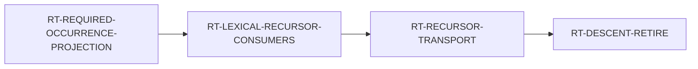

# 2026-08-15

## Steward briefing

## Superseded LIVE block — 2026-08-15 07:00Z

**`main` = `ea3315c7c`.** Tree clean, nothing unpublished, no publisher running.
**33 commits landed 2026-08-15, seven of them code:** `V3-Z3-PROCESS-ADAPTER`,
`RT-LEXICAL-RECURSOR-CONSUMERS` `D2k-1e`, `V3-D-OPEN-GOAL-WITNESS-ROUTE`,
`LANG-INTERVENING-LET-FRAME-WEAKENING` `D1`, `RT-SRCMACHINE-CTOR-RECOGNITION-ARM`,
`LANG-CONVOY-MATCH-FIELD-PROVENANCE`, `LANG-CONVOY-ENCLOSING-FIELD`.

**TWO LANES AND NOTHING ELSE GETS A RING** (operator, 2026-08-15; `steward.md`
§0). Runtime retires `RecursiveDescent`; language + verify do the z3 round-trip.
Finished work still merges, filings queue, and framing for these two lanes is
lane work.

### LANE 1 — one open item, and it is the ring's move, not mine

**`RT-REQUIRED-OCCURRENCE-PROJECTION` candidate `e9e980988` is RED at PR #2293,
and that is settled work rather than an open incident.** `D1` came back
**derivable**, so the Architect's pre-authorized fork did not fire; `D2`-`D4`
built to his §4 shape; QA and Architect both approved the exact SHA. CI then
failed **one test the candidate never edited** —
`lrc_d2a_..._from_all_five_compiles`, the **suppressed** leg.

**Cause: a cross-node control-population collision.** That control asserts over
five named compiles including row 4 depths 2/3 — exactly the rows this node's
approved `D4` advances to `Closure`. **Every AC of both nodes holds; the
collision lives between them, where no node's ACs look.**

- **Attributed decisively, do not redo it:** `main`'s `crates/` tree was
  byte-identical to `9bc035710`, the last green code merge. **Not re-triggered**
  — `M5a`'s re-trigger is only for reds that are not the candidate's.
- **Not a QA miss.** Local runs are targeted-only by operator rule and
  `lrc_d2a_*` sat outside every filter the ring ran. `AC-7`'s
  no-regression-**in-CI** is the only criterion that sees a cross-node
  collision, and it did.
- **Architect ruled `evt_prwxvqcq17cj` and PRE-COMMITTED BOTH BRANCHES**, so the
  next candidate needs **one** Architect pass, not two. My (a)/(b) fork
  presupposed an unmeasured fact: the repaired leg passed for all five, so if
  depths 2/3 die earlier the R1-absence assertion passed **for free** and the
  coverage is already gone in the green half. `D2a`'s counters are **pooled**
  (`reset_lrc_d2a_counts()` once per run, outside the case loop,
  `control.rs:33291`), so it **structurally cannot report per-row arrival**.
- **BINDING ON ME:** do not publish a candidate built to option (b) before the
  per-case table exists. **`dec_310crgf5mashb` is SPENT** — a new SHA needs
  fresh QA and Architect verdicts. Push to
  `wp/RT-REQUIRED-OCCURRENCE-PROJECTION`; PR #2293 stays open and retriggers.

**The full ruling is in the node** —
`docs/program/issues/RT-REQUIRED-OCCURRENCE-PROJECTION.md`. Read it there, never
from this file.

**The retirement chain is now machine-readable** (written at `e7fedca4e`; it had
lived only in prose across three files):

`RT-LEXICAL-RECURSOR-CONSUMERS` has **zero dispatchable increments and that is
measured** — all three items it advertised as owed were discharged by its own
`D2k-1a`. `RT-RECURSOR-TRANSPORT`'s `D3` gate is keyed on the transport landing
**in the tree** (`enum RecursiveDescentResidual`, `core.rs:1979`, two live
variants), never on node status. **Do not "fix" that wording.**

### LANE 2 — verify is BETWEEN work, not blocked

`V3-Z3-PROCESS-ADAPTER` merged at `9bc035710`. The round-trip exists end to end:
an obligation leaves Ken, z3 proposes a candidate assignment, the kernel
disposes of it, **and nothing about why a verdict is believed changed** — the
oracle-not-authority property is structural in the ingestion type.

**`blocks: []` and the throughput successor needs a catalog-scale corpus that
does not exist.** Do NOT invent a z3 successor. **This is the first item for the
operator at 11:30.** `language` is on `LANG-INTERVENING-LET` `D4`, in QA.

**LIVE HAZARD:** the `z3-process-adapter` CI job is in the **required**
`build + test` aggregate, so an apt failure reds every PR fleet-wide. **Do not
just drop it** — `stub(..)` discards stdin, so only that job witnesses SMT-LIB
emission; a replacement control over the query builder comes first. Both items
are coupled in the node.

### Queued, and none of it may jump the lanes

- `CONF-BLOCKER-OWNER-RESOLVABILITY` — `ready`, NOT kicked; enclave, not verify.
- `V3-KRIPKE-THEORY-CLOSURE` — `ready`, NOT kicked, **spec-blocked**: `23 §4`
  marks its own domain and monotonicity axioms `(oracle / standard)` in
  normative text, so the adequacy theorem has no statement to prove. **A third
  ring is the operator's call.**
- ken-interp `Term::J`/`cast_reduce` (`evt_21z3jbnj161q7`) — a **declared** G1
  oracle boundary at `16 §9.1`, **not a defect**.

### Still owed by the operator — three, do NOT re-raise

`evt_h6pbx30amprj`; the `LANG-FOREIGN-NAME-FORMAT-CHARS` threat model;
`evt_30gckze0jryj4`.

### Rules earned 2026-08-15

1. **When a node lists owed items, check its OWN landed partials first.** A
   partial discharges the frame's todo list and nobody updates the frame. All
   three of `RT-LEXICAL-RECURSOR-CONSUMERS`'s were done by its own `D2k-1a`.
2. **A repair block carrying line numbers and a cost argument is what a framer
   turns into a WP.** Open the file before framing it — its line numbers will
   have shifted.
3. **A control's population is a claim a sibling node can falsify without
   touching the control.** Rows migrate; controls written against their old
   routing do not migrate with them.
4. **Check the PASSING half before disposing of a red.** An absence-assertion
   passes for free once the row dies earlier, so the coverage may already be
   gone in the green leg.
5. **A pooled denominator structurally cannot report per-row facts.** Reset
   inside the loop before drawing any per-case conclusion.
6. **A leader's stale status plus an idle QA is how a handback goes unrouted.**
   "Last seen 0m" means the transport is alive, not that the seat acted.
7. **Attribute before re-triggering:** is `main`'s `crates/` tree identical to
   the last **green** code merge? If every commit since is doc-only, the
   candidate is the only code change.
8. **A superseded record is a defect the moment it lands.** I published a fork
   framing four minutes after the Architect superseded it; fix it in the **next**
   commit, not later.

## LIVE — 2026-08-15 11:05Z

**`main` = `030373602`.** Tree clean, nothing held, no publisher running.
Today's code PRs: #2301 (language `D4`), #2305 (runtime census), #2310 (runtime
call-site attribution). Doc-only: #2298, #2300, #2302, #2303, #2304, #2306,
#2308, #2309, #2311. Closed: #2299 (empty), #2307 (conflicting — predated the
census merge; superseded by #2308).

**TWO LANES AND NOTHING ELSE GETS A RING** (operator, 2026-08-15; `steward.md`
§0). Runtime retires `RecursiveDescent`; language + verify do the z3 round-trip.
Finished work still merges, filings queue, and framing for these two lanes is
lane work.

### LANE 1 — three merges this morning; the fork is one field from settled

**`RT-REQUIRED-CONSUMER-REACH-CENSUS` merged at `50aff29b4`** (PR #2305), `D1`
through `D5` delivered. M6 blob identity verified against the **declared**
merge-base; M7-M9 discharged.

**What `D5` established:** the required-consumer route **manufactures the
closure-bearing CROSSING** at `StaticOriginId(5)` / `Constructor.arg[0].Closure`.
Enabled rows are `(closure_present, crossing_reached) = (true, true)`; both
suppressed legs are `(false, false)` and return to `StaticWorkerBinding`.

> **BRANCH 2 IS ELIMINATED, and that is the durable result.** Its antecedent
> required the crossing to be **reached under suppression**, and it is not. It
> was the **only** branch under which these rows and [[RT-CLOSURE-BOUNDARY-LANE]]
> could ever have been one defect ⇒ **the subsumption is dead**, and that node no
> longer waits on this chain to be sized. My derivation from the Architect's
> pre-committed table, flagged as such in both nodes.

**Branches 1 and 3' are NOT separated, and suppression may not be able to
separate them at all.** `closure_path` is computed only at the crossing, so
`closure_child_present: false` on the suppressed rows is an artifact of having no
observation point — both branches predict it. Without the projection these rows
never build the subgraph, so *"does the closure pre-exist"* may be **ill-posed**.
**Do not re-run the differential.** `D5`'s `CLAIMED` line was amended (Architect
`evt_38p42gjq12br`) to stop carrying a branch label it did not establish.

**[[RT-CROSSING-CALL-SITE-ATTRIBUTION]] then MERGED at `637781f41`** (PR #2310),
`D1`-`D3` delivered. Both enabled rows enter the origin-5 crossing with
`invoking_site = GeneratedUnitCallInput` — the tag on `carry_call_input`, **not**
the realization's return surface. `D3` closed all three latent misreports,
including the Adversary's stale-origin-key check (`evt_6mpw6frz1h508`), which now
fires **before** the four-row table and was demonstrated by mutation.

> ### BRANCH 1 IS SELECTED **PROVISIONALLY**, AND THE QUALIFIER IS LOAD-BEARING
>
> The tag sits on a **shared helper with six callers** (`core.rs:17996`,
> `:18014`, `:18350`, `:18434`, `:18449`, and the `carry_source_call_inputs` loop
> at `mod.rs:7618`). It establishes *"a generated-unit call input was being
> carried"* — **not whose call**, which is exactly what separates the branches.
> Callee the source program already calls ⇒ **1**; the projected consumer's
> generated unit ⇒ **3'** survives.
>
> **The supporting claim grounds and is still not enough.**
> `realize_required_consumer_locally` ends at `RoutedAnswer::composed_answer(...)`
> and carries nothing, so this is not its **return** surface — **but ruling out
> the return surface does not rule out the realization emitting a CALL.**

**The successor is [[RT-CROSSING-CALLEE-IDENTITY]]** — `ready`, `S`, kicked at
`evt_7v2y8ptre3xfs` (**new thread**). One tag finer, not a new instrument: record
the callee's unit identity, decide the branch per row, and **resolve the
"provisional" qualifier in the tree**. Its `D3` exercises the tag's unused
negative arm — `BoundaryTransferInvokingSite` has two inhabitants and every
assertion reports the same one (`control.rs:6305`, `:6329`).

> **NO REPAIR NODE MAY BE CUT BEFORE IT MEASURES** — the Architect's sequencing
> (`dec_5m10b60wam0rz`), because a repair cut against branch 1 while 3' holds is
> the `D2k-1c` cost arriving at the last possible moment.

**Three merges on this chain this morning.** The recurring shape, worth naming:
**the measurements have been sound and the labels have overreached** — `D5`'s
`CLAIMED` line, then `D2`'s delivery inference. Both were caught by reading the
instrument rather than the result.

**No further successor is framable until `CALLEE-IDENTITY` decides the branch —
the repair node's owner and file follow from that selection. Not framing debt.**

**Chain:** `PROJECTION` (merged) → `CENSUS` (merged) → `CALL-SITE` (merged) →
`CALLEE-IDENTITY` (ready) → repair → `TRANSPORT` → `DESCENT-RETIRE`.
`RT-RECURSOR-TRANSPORT`'s `D3` gate is keyed on the **tree** (`enum
RecursiveDescentResidual`, `core.rs:1979`, two live variants), never on node
status. **Do not "fix" that wording.**

### LANE 2 — language's `D4` merged, `D2` widened, verify between work

**`LANG-INTERVENING-LET-FRAME-WEAKENING` `D4` MERGED AT `7b11bbd84`** (PR
#2301, exact `956d86921`, `dec_7r12dsg9py2a4`). M6-M9 all discharged. **The node
stays `active` — `D2` and `D3` are deferred, not done.** `D1` had already landed
at `beb31566b` (PR #2282) when its publish was requested; PR #2299 closed empty.

**`D2` is now WIDENED to all four operand assertions in
`ds5b_dependent_match_refinement_acceptance.rs`** (Adversary hunt
`evt_399y8ys1ftnee`, accepted; landed `505e9b5cd`, PR #2303; notified
`evt_1s48da3b9zzga`). `contains("@4")` was one of **three** unanchored
substrings, and the third (`:507`) sat on merged `D1`'s node — a file-level
convention split across two nodes, with one half owned by nobody.

> **The two findings do NOT stack.** Architect Finding 1 **deletes** `:599`
> and `:604` — the error class alone discriminates — so anchoring them is moot.
> **Anchoring is the live repair only at `:507`**, where `Dg67` is a name, not a
> positional level. `AC-6` states the four-site outcome. Details in the node.

**Before publishing anything:** `git diff --quiet origin/main <head> -- <declared
paths>`. A squash rewrite makes a **landed** head read as owed forever, and two
seats' statuses agreed on that stale read — which is not corroboration.

**`V3-Z3-PROCESS-ADAPTER` merged.** `blocks: []`, and the throughput successor
needs a catalog-scale corpus that does not exist. **Do NOT invent a z3
successor.**

**LIVE HAZARD:** the `z3-process-adapter` CI job is in the **required**
aggregate, so an apt failure reds every PR fleet-wide. **Do not just drop it** —
only that job witnesses SMT-LIB emission, because `stub(..)` discards stdin.

### The operator brief for 11:30 — three items, and that is the whole list

1. **Verify has no directed successor.** Between work, not blocked.
2. **`V3-KRIPKE-THEORY-CLOSURE` is `ready`, framed, enclave-owned**, and closes
   lane 2's FO Kripke half; `spec-leader` is idle awaiting a released node. **I
   did not kick it.** §0 rule 1 bans starting a third ring *"however well-framed
   and however idle the team"*, and *"this idle team unblocks a priority lane"*
   is recognizably one of the three arguments that already defeated the priority
   once today. **Operator's call, and the work is not wasted whenever it runs.**
3. **Language has no lane-2 successor.** Its current node is elaborator work
   discharging an Architect follow-up, not the z3 round-trip.

**Still owed by the operator — three, do NOT re-raise:** `evt_h6pbx30amprj`;
the `LANG-FOREIGN-NAME-FORMAT-CHARS` threat model; `evt_30gckze0jryj4`.

### Queued, and none of it may jump the lanes

- **The publisher gate misdiagnoses an already-landed candidate as an
  environment fault.** `scripts/scripted-pr-automerge.sh:519` does `git merge
  --squash` then `git commit`; when the candidate is **already contained in
  `main`** the merge stages nothing and the commit exits non-zero with *"nothing
  to commit"*. The gate carefully separates merge-failure from commit-failure
  and then reports *"an environment fault in the publisher... check that the
  scratch worktree is writable"* — **which sends the reader to look at disk and
  permissions for a condition that is neither.** Measured 2026-08-15 on PR #2299.
  **The fix is one probe:** if `git diff --quiet origin/main <head>` (or the
  squash stages nothing), say *the candidate is already contained in `main`* and
  name the landing commit. **Mine, and it queues** — it is `scripts/`, so it is
  outside the Adversary's scope by `COORDINATION §10⁻a` and is found only by
  whoever trips over it.
- The **tri-state convention** the Adversary raised (`evt_62attjpj3esa`): the
  empty-scan fallback and `validator_admitted` on `D2k-1e` are the same shape —
  a two-state observation standing in for a three-state question whose missing
  state is *the instrument did not observe*. **Two nodes owe one conversion**,
  so it wants one convention, not two half-arguments. Explicitly excluded from
  the census node's scope.
- `CONF-BLOCKER-OWNER-RESOLVABILITY` — `ready`, NOT kicked; enclave.
- ken-interp `Term::J`/`cast_reduce` — a **declared** G1 oracle boundary at
  `16 §9.1`, **not a defect**.

### Rules earned 2026-08-15

1. **"Unblocked" is not "reachable".** A surface can land, clear every tracker
   edge, and still not reach part of its population — check the guard that
   mints it, not the node's status.
2. **Scope a stop condition to the deliverable that depends on it**, never to
   the node. Mine stopped `D2` and `D4`, which never depended on the fork, and
   the ring's wide reading was the correct reading of what I wrote.
3. **A shared refusal sentence is shared syntax.** When the gate is total, every
   population reaches it; the attribution is upstream.
4. **Resolve a participant id at post time, from the script.** A guessed id
   posts successfully and notifies nobody — it looks like a delivered message
   and is a silent stall.
5. **A control's population is a claim a sibling node can falsify** without
   touching the control.
6. **Check the PASSING half before disposing of a red** — an absence-assertion
   passes for free once the row dies earlier.
7. **A pooled denominator structurally cannot report per-row facts.**
8. **Attribute before re-triggering:** is `main`'s `crates/` tree identical to
   the last **green** code merge?
9. **Two accepted findings on one site can prescribe OPPOSITE remedies.** Both
   were right; one deletes the assertion, the other anchors it, and doing both
   is a defect. When you widen a scope from a second report, state per site
   **which** remedy applies — a merged list reads as "apply everything."
10. **A defect spanning two nodes has a half owned by nobody** once one of them
    merges. Check whether the sibling half sits on a closed node before scoping
    the repair to the open one.

