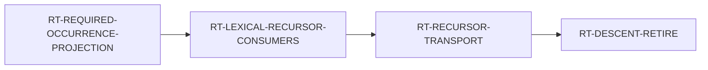

# Current briefing (live — read this first on every Steward resume)

> ## HOW TO READ THIS FILE, AND WHEN TO DISTRUST IT
>
> **`origin/main` outranks this file, always.** If anything below tells you to
> do something `git fetch origin` shows as landed, **this file is stale and the
> repository is right.** Re-read fresh, in this order:
>
> 1. `git fetch origin && git rev-parse origin/main`
> 2. the LIVE block below — **only** the LIVE block
> 3. the open tasks (do not re-derive priority from memory)
> 4. for what is HELD, DEFERRED, or WHOSE it is: **the node**
>    (`docs/program/issues/*.md`), its operative block — never this file
>
> **This file is a resume POINTER, not an archive. Git is the archive.** When a
> window closes its block is **deleted**, not demoted to a "superseded" section —
> a superseded block left in the file gets read by someone, eventually.
>
> ### THE THREE FILES, so you do not go looking in the wrong one
>
> | you want | read |
> |---|---|
> | the current window — **only** the live block lives here | this file |
> | permanent, undated material: operator rulings, preserved refs, standing traps | [`STANDING.md`](STANDING.md) |
> | what happened on day X | `2026/Mon/DD.md`, indexed by [`INDEX.md`](INDEX.md) |
>
> **This file holds ONE block: the current one. Under 250 lines.** A superseded
> block moves to the dated diary **even if it is an hour old** — "recent" is not
> the test, "current" is. Flushed daily by a delegated subagent; procedure in
> `agent/playbooks/federation/steward/briefing-flush.md`.
>
> ⚠ **It reached 4648 lines / 273 KB across 19 unflushed days before anyone
> noticed** — having already been rewritten to be small once, in July. Nothing
> reds when it grows. If you are adding a block and the file is over budget,
> flush first.

> ### PRE-2026-07-26 CONTENT IS AT BLOB `c26ee67f`
>
> ~2700 lines of windows back to 2026-07-21, archived here on 2026-07-26 --
> `git show c26ee67f`. **The rewrite audit was a SCAN, not exhaustive**: headings,
> authoritative-looking blocks, then a sweep for sole-source markers, decision
> ids, held items and preserved refs. A reader needing something from before that
> date should assume it is in the blob, not that it was considered. (The scan is
> what found two self-declared-authoritative blocks that were wrong, and a
> hand-maintained list of 6 preserved refs when origin held 26.)

## LIVE — 2026-08-15 07:00Z

**`main` = `ea3315c7c`.** Tree clean, nothing unpublished, no publisher running.
**33 commits landed 2026-08-15, seven of them code:** `V3-Z3-PROCESS-ADAPTER`,
`RT-LEXICAL-RECURSOR-CONSUMERS` `D2k-1e`, `V3-D-OPEN-GOAL-WITNESS-ROUTE`,
`LANG-INTERVENING-LET-FRAME-WEAKENING` `D1`, `RT-SRCMACHINE-CTOR-RECOGNITION-ARM`,
`LANG-CONVOY-MATCH-FIELD-PROVENANCE`, `LANG-CONVOY-ENCLOSING-FIELD`.

**TWO LANES AND NOTHING ELSE GETS A RING** (operator, 2026-08-15; `steward.md`
§0). Runtime retires `RecursiveDescent`; language + verify do the z3 round-trip.
Finished work still merges, filings queue, and framing for these two lanes is
lane work.

### LANE 1 — one open item, and it is the ring's move, not mine

**`RT-REQUIRED-OCCURRENCE-PROJECTION` candidate `e9e980988` is RED at PR #2293,
and that is settled work rather than an open incident.** `D1` came back
**derivable**, so the Architect's pre-authorized fork did not fire; `D2`-`D4`
built to his §4 shape; QA and Architect both approved the exact SHA. CI then
failed **one test the candidate never edited** —
`lrc_d2a_..._from_all_five_compiles`, the **suppressed** leg.

**Cause: a cross-node control-population collision.** That control asserts over
five named compiles including row 4 depths 2/3 — exactly the rows this node's
approved `D4` advances to `Closure`. **Every AC of both nodes holds; the
collision lives between them, where no node's ACs look.**

- **Attributed decisively, do not redo it:** `main`'s `crates/` tree was
  byte-identical to `9bc035710`, the last green code merge. **Not re-triggered**
  — `M5a`'s re-trigger is only for reds that are not the candidate's.
- **Not a QA miss.** Local runs are targeted-only by operator rule and
  `lrc_d2a_*` sat outside every filter the ring ran. `AC-7`'s
  no-regression-**in-CI** is the only criterion that sees a cross-node
  collision, and it did.
- **Architect ruled `evt_prwxvqcq17cj` and PRE-COMMITTED BOTH BRANCHES**, so the
  next candidate needs **one** Architect pass, not two. My (a)/(b) fork
  presupposed an unmeasured fact: the repaired leg passed for all five, so if
  depths 2/3 die earlier the R1-absence assertion passed **for free** and the
  coverage is already gone in the green half. `D2a`'s counters are **pooled**
  (`reset_lrc_d2a_counts()` once per run, outside the case loop,
  `control.rs:33291`), so it **structurally cannot report per-row arrival**.
- **BINDING ON ME:** do not publish a candidate built to option (b) before the
  per-case table exists. **`dec_310crgf5mashb` is SPENT** — a new SHA needs
  fresh QA and Architect verdicts. Push to
  `wp/RT-REQUIRED-OCCURRENCE-PROJECTION`; PR #2293 stays open and retriggers.

**The full ruling is in the node** —
`docs/program/issues/RT-REQUIRED-OCCURRENCE-PROJECTION.md`. Read it there, never
from this file.

**The retirement chain is now machine-readable** (written at `e7fedca4e`; it had
lived only in prose across three files):

`RT-LEXICAL-RECURSOR-CONSUMERS` has **zero dispatchable increments and that is
measured** — all three items it advertised as owed were discharged by its own
`D2k-1a`. `RT-RECURSOR-TRANSPORT`'s `D3` gate is keyed on the transport landing
**in the tree** (`enum RecursiveDescentResidual`, `core.rs:1979`, two live
variants), never on node status. **Do not "fix" that wording.**

### LANE 2 — verify is BETWEEN work, not blocked

`V3-Z3-PROCESS-ADAPTER` merged at `9bc035710`. The round-trip exists end to end:
an obligation leaves Ken, z3 proposes a candidate assignment, the kernel
disposes of it, **and nothing about why a verdict is believed changed** — the
oracle-not-authority property is structural in the ingestion type.

**`blocks: []` and the throughput successor needs a catalog-scale corpus that
does not exist.** Do NOT invent a z3 successor. **This is the first item for the
operator at 11:30.** `language` is on `LANG-INTERVENING-LET` `D4`, in QA.

**LIVE HAZARD:** the `z3-process-adapter` CI job is in the **required**
`build + test` aggregate, so an apt failure reds every PR fleet-wide. **Do not
just drop it** — `stub(..)` discards stdin, so only that job witnesses SMT-LIB
emission; a replacement control over the query builder comes first. Both items
are coupled in the node.

### Queued, and none of it may jump the lanes

- `CONF-BLOCKER-OWNER-RESOLVABILITY` — `ready`, NOT kicked; enclave, not verify.
- `V3-KRIPKE-THEORY-CLOSURE` — `ready`, NOT kicked, **spec-blocked**: `23 §4`
  marks its own domain and monotonicity axioms `(oracle / standard)` in
  normative text, so the adequacy theorem has no statement to prove. **A third
  ring is the operator's call.**
- ken-interp `Term::J`/`cast_reduce` (`evt_21z3jbnj161q7`) — a **declared** G1
  oracle boundary at `16 §9.1`, **not a defect**.

### Still owed by the operator — three, do NOT re-raise

`evt_h6pbx30amprj`; the `LANG-FOREIGN-NAME-FORMAT-CHARS` threat model;
`evt_30gckze0jryj4`.

### Rules earned 2026-08-15

1. **When a node lists owed items, check its OWN landed partials first.** A
   partial discharges the frame's todo list and nobody updates the frame. All
   three of `RT-LEXICAL-RECURSOR-CONSUMERS`'s were done by its own `D2k-1a`.
2. **A repair block carrying line numbers and a cost argument is what a framer
   turns into a WP.** Open the file before framing it — its line numbers will
   have shifted.
3. **A control's population is a claim a sibling node can falsify without
   touching the control.** Rows migrate; controls written against their old
   routing do not migrate with them.
4. **Check the PASSING half before disposing of a red.** An absence-assertion
   passes for free once the row dies earlier, so the coverage may already be
   gone in the green leg.
5. **A pooled denominator structurally cannot report per-row facts.** Reset
   inside the loop before drawing any per-case conclusion.
6. **A leader's stale status plus an idle QA is how a handback goes unrouted.**
   "Last seen 0m" means the transport is alive, not that the seat acted.
7. **Attribute before re-triggering:** is `main`'s `crates/` tree identical to
   the last **green** code merge? If every commit since is doc-only, the
   candidate is the only code change.
8. **A superseded record is a defect the moment it lands.** I published a fork
   framing four minutes after the Architect superseded it; fix it in the **next**
   commit, not later.

