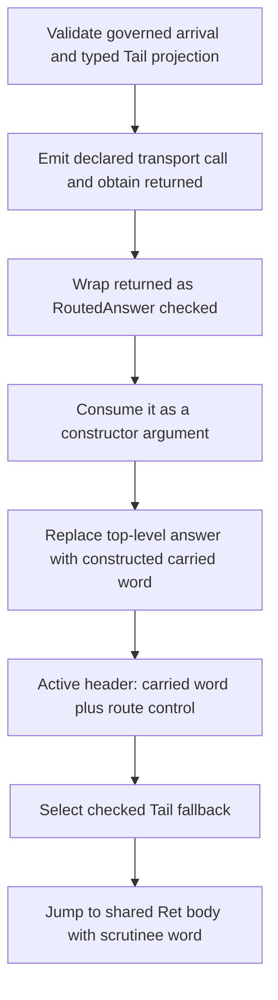

# Tail-resumptive composed return: constraint differential

This report answers
`RT-COMPOSED-RETURN-CONSTRAINT-DIFFERENTIAL` at
`6c127a40d377a56e9daecddf3c55b05e800629ec`. It is comparative analysis,
not a mechanism selection. It changes no runtime source, runs no PX8 or CI
closure, and makes no build authorization.

The construction is ordinary monadic composition:

```text
bind t (\x. Ret (f x))
```

The existing `fs-read-at-offset` and `fs-write-at-offset` programs reach its
Tail route from checked Ken source. The open question is therefore not whether
this construction has a lowering. Interaction Trees gives the construction a
direct semantic interpreter, and Koka gives it a compiled direct-call route.
The question is which extra constraints Ken imposes that those systems do not.

## Result

Both blocking constraints are **incidental to the current native lowering**.
Neither is required by the Ken specification.

| shape | blocking Ken constraint | comparator delta | Ken element that would move |
|---|---|---|---|
| (a) validate before the existing producer | The call result is wrapped as a checked source-machine answer, then consumed as constructor material and replaced by a constructed carried word before the Tail `Ret` edge. The earlier proof can refuse but has no result-to-`Ret` data edge. | Interaction Trees and Koka make the response-return edge itself the continuation edge: the selected continuation receives the produced response directly. There is no intervening answer collapse. | Producer order and the source-machine-to-carried defunctionalization boundary. |
| (b) move the producer after Tail selection | The selected-case ordinary operand envelope has expired. The active backedge carries only the current carried word and route-control word; it lacks the source constructor's nonrecursive fields and selected-worker captures. Publication has also quotiented away member identity. | Koka selects and calls the handler while operation arguments and the ordinary call environment are live. Ordinary CPS carries free variables in a closure or explicit parameters; SSA carries the response and environment forward as block arguments. | Generated-entry quotient **and** the two-word backedge ABI, or the defunctionalization that created both. |

The shared delta is not “other systems move a value backward.” They never need
to. They retain the operation/continuation association until the response is
produced and then move the response forward into that continuation. Ken first
separates those facts across a source-machine collapse, a generated-entry
quotient, and a two-word carried loop, then asks a later point to reconstruct
them.

## Normative boundary

The specification mandates the observable result and the single tail
resumption. It does not mandate the current compiler representation.

- `spec/30-surface/36-effects.md` sections 2.1 and 2.2 define `Vis e k`, with
  `e : E.Op`, `k : E.Resp e -> ITree E R`, and `bind` grafting its second
  argument onto each `Ret` leaf.
- `spec/40-runtime/42-evaluation.md` section 6.2 requires the driver to perform
  and observe `H e`, apply the exact `k` to that response once in tail
  position, and continue with the resulting tree.
- `spec/30-surface/36-effects.md` section 5.2 forbids reified or multi-shot
  continuations. It does **not** forbid an ordinary function call, an ordinary
  closure, or a forward SSA block argument. The `Vis` continuation is itself an
  ordinary function value.
- `spec/40-runtime/45-native-backend.md` sections 3 and 4 require native
  observable agreement with the interpreter while explicitly leaving calling
  convention, closure representation, instruction schedule, and other internal
  strategy private.

Therefore the following are not spec rules: source-call emission before a
later carried-match selection; `RoutedAnswer` collapse; the generated-entry
confluence quotient; a two-`i64` active backedge; or a carried discriminant
instead of an ordinary continuation function. Strict CBV is mandated, but Koka
and the described CPS/SSA route are strict and forward; Interaction Trees
independently exposes the same forward response-to-continuation edge
semantically. CBV is not the obstruction.

## The current Ken order

The relevant current-main blobs are:

| artifact | blob |
|---|---|
| `lowering/source.rs` | `88fcc401b0e078f78298a0998d09364b22e64a27` |
| `lowering/core.rs` | `79ec94b749836a6e1747d6b6da0b572f919105cd` |
| `planning/static_transition/aggregates.rs` | `9eb2c118e227c3a7db2849e03046db02d93a48eb` |
| `planning/static_transition/continuations.rs` | `2f7700d15dd37bb834533ea879425143e2221e90` |

The route is:



`source.rs:3976-4117` already validates the governed call and its fresh-result
route. The transport call at `:4369-4371` then produces `returned`, and `:4373`
wraps it as `RoutedAnswer::checked(returned)`. This ordering explains why the
shape-(a) authority join was constructively valid.

It does not create the semantic edge. The general source-machine loop
splits `RoutedAnswer` at `source.rs:1250-1264`. Its `ConstructArgument` arm
pushes the operand into the constructor field run at `:1647`; after
construction, `:1691-1710` creates a **new** top-level
`RoutedAnswer::direct(constructed)`. The call result survives, at most, as
material inside a carried constructor. It is no longer the top-level answer
that a later `Ret` predecessor can name.

The carried eliminator then loops. `core.rs:12225-12258` emits the active
backedge with exactly two values: `scrutinee.word` and a route-control word.
The header at `:12260-12282` declares exactly two parameters. After ordinary
constructor cases miss, `:12634-12743` selects the checked fallback and passes
that same `scrutinee.word` to the shared `return_body`. The ordinary `Ret`
predecessor at `:12433-12445` instead passes its projected child to that block.
The shared block is sound; the checked predecessor supplies the wrong value.

This is a forward-dataflow absence. Cranelift 0.113.1 requires an instruction
result or block parameter to dominate every use and requires branch arguments
to match destination block parameters (`verifier/mod.rs:875-946` and
`:1310-1354`). A proof value in Rust cannot make an earlier SSA result appear at
a later predecessor after the path that carried it has been collapsed.

## Shape (a): validate before the producer

### Exact Ken constraint

The constraint is more precise than “validation occurs too late.” Governed
validation already precedes the current call. What occurs too late is the
**Tail continuation sink**, and what occurs between the call and that sink is a
lossy defunctionalization step.

The validated projection identifies the correct Tail destination, and the call
produces the correct word, but the current protocol has no typed edge pairing
those two facts. The result enters `RoutedAnswer`, becomes constructor material,
and is replaced at the top level before the carried loop selects the Tail
fallback. An opaque pre-producer authority proof can reject a mismatch before
emission; it cannot change this later edge from `scrutinee.word` to `returned`.

This constraint is **INCIDENTAL**. Sections 36.2.2 and 42.6.2 require the
response/result to reach the continuation. They do not require `RoutedAnswer`,
a source-machine constructor collapse, or a later carried selector.

### Interaction Trees comparator

Interaction Trees commit
`68b3568d3f0f48c057192c58c8db88ef4412747a` keeps the relevant association
structural:

1. A visible node contains the typed event and its exact continuation together.
2. `bind` rewrites a visible node by preserving its event and composing the
   remaining bind into that node's continuation.
3. `interp` observes one visible node, invokes the handler for its event, and
   maps the produced response directly into the already-selected continuation.

The order is therefore:

```text
observe exact (event, continuation)
-> invoke handler(event)
-> receive response
-> continuation(response)
```

Across the resume it carries the continuation function itself. That function
contains its lexical environment; the visible node still owns the event while
handler dispatch happens. There is no separate later lookup of a confluence
class and no answer-to-constructor-to-backedge collapse.

This is a semantic/functional comparator, not a prescribed native ABI. Its
constraint delta is nevertheless exact: source identity is represented by the
selected continuation value, and the handler result is consumed at that value's
application site. Ken instead turns the continuation into a carried recursive
route, then publishes a projection that cannot name the source member.

Sources:

- `theories/Core/ITreeDefinition.v`, `itreeF` and `ITree.subst`;
- `theories/Interp/Interp.v`, `interp`'s visible-event arm.

### Koka comparator

Koka commit `429f578512ba7229ec86a2389d4d2481100d17bc` gives the compiled
counterpart. A tail-resumptive `fun` operation is guaranteed to resume once
with its final result. At an operation call site, evidence passing selects the
handler from the evidence vector **before** invoking it, then calls the handler
as an ordinary function with an adjusted evidence environment. The result
returns normally to the call site. General control operations would yield,
capture a stack, and resume; the tail-resumptive route explicitly avoids all
three.

For the semantic core here, the direct-style order is equivalent to:

```text
select handler for t
-> call t with its operation arguments and evidence
-> receive x
-> compute f x
-> return that result
```

The caller's ordinary activation remains the continuation environment. Koka
therefore has no analogue of Ken's interval in which a correct response is
turned into constructor material and loses its continuation sink. Its
`AnalysisResume` pass classifies tail use before backend lowering; a declared
`fun` operation can avoid a runtime tail-resumption check, and a linear effect
can avoid the monadic transformation entirely.

Koka does retain an evidence vector for dynamic handler selection. Importing
that mechanism literally would violate this Ken frame's runtime-discriminator
prohibition. The useful differential is the order, not a recommendation to
adopt the vector: handler identity and the ordinary return continuation are
available together before the handler produces its result.

Sources:

- `doc/spec/tour.kk.md`, “Tail-Resumptive Operations”;
- `src/Core/AnalysisResume.hs`, the tail/scoped/once analysis;
- `src/Common/ResumeKind.hs`, the closed resume-kind classification.

### Constraint delta and cost

The comparators provide a **direct response-to-continuation edge**. Ken lacks
that edge even though it has a pre-producer proof of the intended destination.
Making shape (a) sufficient would therefore change more than validation:
producer emission and the exact Tail continuation consumption would have to be
co-located on one forward dataflow path, before the general answer collapse, or
the collapse would have to preserve a source-specific continuation application.

The affected design element is the **producer order plus the
source-machine/carried defunctionalization boundary**. The generated-entry
quotient might remain for other consumers, but it could no longer be the only
identity available at the result's consumption point.

Rough cost: **high and cross-cutting**, not novel. It reaches the source-machine
`RoutedAnswer` protocol, constructor transfer, planner fresh-result relation,
carried-match predecessor, and causality controls. It may preserve the
backedge's two-word shape only if the call and exact `Ret` consumption occur
before that backedge; otherwise it becomes shape (b)'s ABI problem.

## Shape (b): de-quotient, then produce after Tail selection

### Exact Ken constraints

Shape (b) meets two independent constraints. Relaxing only one remains
insufficient.

First, member identity is erased on publication. The pre-quotient row at
`aggregates.rs:5902-5977` returns the exact
`ContinuationCallIdentity` separately from its projection. Confluence
construction at `:6123-6257` groups equal projections and keeps identities only
inside `CheckedIhGeneratedEntryConfluence.members`. Publication at
`:6323-6543` installs only `confluence.projection.clone()` in a
`Governed` admission. `CheckedIhGeneratedEntryAccess` deliberately makes the
member set and retarget caller unrepresentable. This quotient is
**INCIDENTAL**; no spec section assigns semantic identity to generated native
functions.

Second, after Tail selection the call's runtime ordinary operands no longer
exist at that CFG point. `call_checked_ih_transport_from_case_environment` at
`core.rs:7642-7847` assembles two runs:

- the ordinary envelope: every nonrecursive source-constructor field, followed
  by selected-worker captures; and
- continuation inputs, transported by the planner morphism.

The planner morphism covers only continuation inputs
(`aggregates.rs:4401-4463`). It has no row for a nonrecursive constructor field
or worker capture. `ContinuationOrdinaryEnvelopeRole` at
`continuations.rs:1722-1756` expressly says this is a source-role projection,
not a worker-body environment map.

The earlier selected-case environment owns those operands. The active
self-resumption backedge carries only its current word and control. No
nonrecursive field or worker capture dominates the later checked predecessor,
and there is no block parameter for one.

The distinction is typed, not an unlucky slot layout. A `Vis` source node has a
nonrecursive `E.Op` field and a recursive continuation whose argument is
`E.Resp e` (`36 §2.1`). The generated worker's raw argument is the response.
The ordinary envelope still needs the operation. Reusing the response word as
the operation would synthesize authority from coordinate coincidence and can be
type-wrong even when both happen to occupy one machine word.

The two-word backedge and ordinary-envelope split are **INCIDENTAL**. The spec
requires both `e` and `k` to be available when performing the visible node and
requires the resulting response to be applied to `k`. It does not say that the
operation must be discarded before a later block reconstructs a call frame.

### Koka comparator

Koka avoids both missing facts at the same point. The operation call site has:

- the operation's ordinary arguments;
- the evidence entry identifying its handler; and
- the ordinary caller continuation and its lexical environment.

It selects the handler while these are live, invokes the tail handler as a
regular function, and receives the response as that function's return. No
source member must be recovered after a loop and no operation envelope must be
recreated from the response. Closure conversion and the ordinary target ABI
carry captured lexical values in the conventional direction, caller to callee;
the result returns callee to caller.

The constraint delta is thus not merely “Koka carries more.” It does not split
operation arguments, handler selection, and return continuation across three
phases. Koka needs no analogue of Ken’s later-recovered source-member identity:
evidence selection happens at the still-live operation call site, while the
ordinary call activation preserves that site’s return continuation and lexical
environment. Together those facts retain the operation-to-continuation
association that Ken’s quotient and backedge separate.

Again, the evidence vector is not a prohibition-clean Ken design. It shows
which resources a successful implementation retains and when: identity and
operation operands are present before invocation, not reconstructed afterward.

### Plain CPS and SSA joins

The following comparison rests on standard CPS/SSA lowering knowledge rather
than a mounted reference implementation.

A conventional CPS translation represents the continuation of `t` as a
function or block. Free variables of that continuation are closure-converted
into an environment or passed as explicit parameters. The producer invokes the
continuation with its result. In SSA form, the same relation is a forward branch
from the producer to a join block whose parameters include the result and any
live environment values.

For this construction the core graph is:

```text
producer(operation, environment, continuation K)
K(response, captured environment):
  result = f(response)
  jump Ret(result)
```

A statically specialized continuation gives shape (b)'s per-function identity
by construction. But specialization alone is not enough: every free variable
needed by the relocated producer or continuation must still dominate the block
or be passed as a block/function argument. Conventional closure conversion does
that mechanically. Ken's current split deliberately does not: its generated
entry carries raw worker arguments/captures and continuation inputs, while the
source ordinary envelope is a separate role projection; the active backedge
passes neither envelope nor closure environment.

This comparator therefore confirms the axis-3 refutation rather than evading
it. A post-selection producer is ordinary SSA only after the missing envelope
has become an explicit forward parameter. De-quotienting a function name cannot
manufacture runtime operands.

### Constraint delta and cost

A comparator either:

1. retains a source/member-specific continuation function whose environment
   already contains the necessary values; or
2. passes all live operation/envelope values explicitly across the control-flow
   edge.

Ken currently does neither. It has a quotient-wide generated entry plus a
backedge containing only `{carried_word, route_control}`.

The affected design elements are therefore the **generated-entry quotient** and
**two-word carried-value backedge ABI together**. A member-specific function
would also require closed caller retargeting and an entry/call ABI containing
the ordinary envelope. Alternatively, retaining the quotient while widening
the backedge would change the carried ABI and every header/predecessor that
constructs it. Replacing the loop with ordinary continuation calls would change
the defunctionalization itself.

Rough cost: **very high and broad, but conventional compiler work**. The blast
radius includes confluence/access types, generated-function population and code
size, caller closure, frame slot/lifetime planning, header block parameters,
call operand assembly, and the exact result-to-shared-`Ret` SSA edge. The spec
and kernel do not change.

## Comparative synthesis

The comparators share four properties:

1. **Identity before response.** The handler or continuation is selected before
   the response is produced.
2. **No identity-destructive middle.** The response is not collapsed into a
   generic carrier and later associated with a continuation by projection.
3. **Forward environment transport.** Needed operation arguments and lexical
   values remain in a call frame/closure or travel as explicit parameters.
4. **Response as the continuation argument.** The produced response/result is
   the exact value passed to the continuation or `Ret` join.

Ken's specification already has the first-class semantic objects that express
all four: `Vis e k`, `H e`, and `apply k resp`. The current native lowering adds
the conflicting constraints:

```text
source-machine answer collapse
+ generated-entry member quotient
+ two-word carried backedge
```

No comparator preserves that triple. This is the useful correction to the
earlier advisory: absence of a technique that preserves Ken's triple does not
make the construction difficult. It identifies the triple as the delta.

## Decision input, not a decision

Shape (a) can match Interaction Trees/Koka only if “validation before producer”
is strengthened to “the validated response producer and exact continuation sink
share one forward dataflow edge before answer collapse.” The already-built
private proof alone is insufficient.

Shape (b) can match Koka/CPS only if static de-quotienting is paired with runtime
operand availability. That means changing the two-word ABI, creating a
member-specific closure/frame with the envelope, or replacing this
carried-value defunctionalization. Static identity alone remains refuted.

Both relaxation families are compatible with Ken's normative single-shot,
tail-position discipline and native differential contract. Neither requires a
spec change. Their costs differ in where the native architecture moves; this
report does not select between them.

## Sources and provenance

Ken sources were read at exact
`6c127a40d377a56e9daecddf3c55b05e800629ec`.

Permissive prior art:

- Interaction Trees, commit
  `68b3568d3f0f48c057192c58c8db88ef4412747a`, MIT license.
  `Interp.v` SHA-256
  `e75c9aca6a5362ea4b48d73bf19ec374de3bd5d0fd834a5c136b5625de144589`.
- Koka, commit `429f578512ba7229ec86a2389d4d2481100d17bc`,
  Apache-2.0. Tour SHA-256
  `6939f84d633921848e5f40459f2eaf6a00773c3b3575003ece986507b259653f`;
  resume analysis SHA-256
  `3cc64d560475dba5b1a745434c02a871299689662290e496292b9cfeea8036c2`.
- Cranelift Codegen 0.113.1, Apache-2.0 with LLVM exception. Verifier source
  SHA-256
  `83f47938508090385159d419b7ae2c1acdcd29e978b9a494d40545c013b8dc52`.

Public coordinates:

- <https://github.com/DeepSpec/InteractionTrees/tree/68b3568d3f0f48c057192c58c8db88ef4412747a>
- <https://github.com/koka-lang/koka/blob/429f578512ba7229ec86a2389d4d2481100d17bc/doc/spec/tour.kk.md#tail-resumptive-operations>

The CPS/SSA paragraph is explicitly general compiler knowledge, not a claim
about an uninspected implementation. No Yon or other excluded AGPL prototype
source was consulted. No reference expression was copied into Ken.
