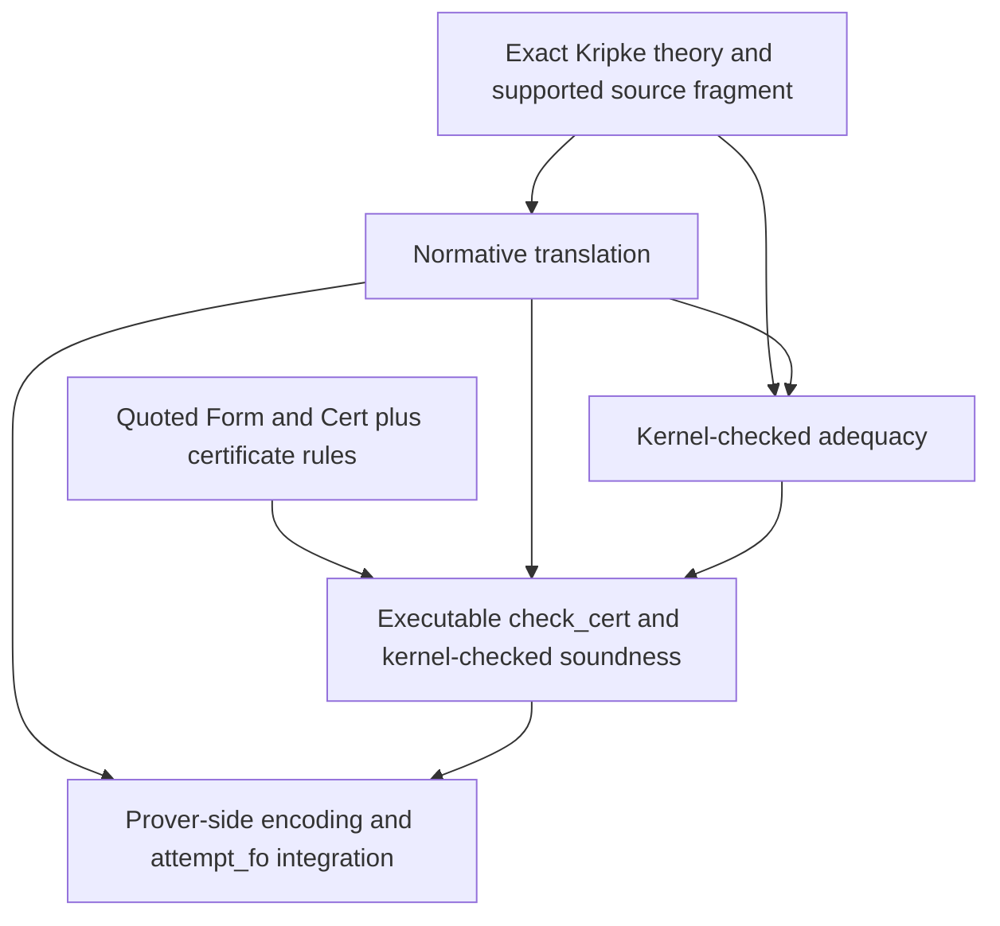

# V3 Kripke decomposition report

This report prices the missing first-order route by identifying its pieces,
dependencies, and owners. It reaches the frame's specification hard stop: the
current contract does not determine the exact Kripke theory or reflective
certificate language well enough to size an honest prover increment. Nothing
here authorizes a build or establishes that V3 should proceed.

## Grounded baseline

The shipped `attempt_fo` still delegates unchanged to `attempt_ipc`; its own
documentation marks the embedding, `World` theory, adequacy lemma, and checker
soundness as placeholders
(`crates/ken-elaborator/src/prover.rs:326-341`). The repository contains no
production `embed`, quoted `Form`/`Cert` types, or `check_cert`. The existing
`FormRef` and `KripkeCountermodel` belong to diagnostics: their evaluator is
advisory, does not affect a verdict, and explicitly refuses `Pi` and `Sigma`
without typed valuations, domains, substitution, and witnesses
(`crates/ken-elaborator/src/diagnostics.rs:61-75,143-188`). They are not an FO
certificate language or an implementation head start.

The program DAG nevertheless records V3 as classifier plus solver, Kripke
embedding, and reflective certificate, dependent on V2
(`docs/program/05-implementation-dag.md:163-167`). Spec `23` chooses reflective
route (a) as the target and retains reconstruction route (b) only as a
feasibility hedge (`spec/20-verification/23-prover.md` §4). That architectural
choice is settled. The inputs needed to realize it are not.

## D1 and D2: pieces, dependencies, and lanes

| piece | what it is | real dependencies | lane and boundary |
|---|---|---|---|
| `World`, preorder, domains, and monotone forcing | The external classical FO theory in which `φ#` is interpreted: a world sort, accessibility preorder, growing domains, and persistent atomic forcing. These are not Ken kernel terms (`23` §8, lines 369–373). | Exact frame/domain/forcing axioms and the supported atom theories. Spec `23` currently labels the exact domain and monotonicity axioms `(oracle / standard)` and assumed (`§4`, lines 187–188 and 238–244). | **Spec.** The enclave must close the normative theory. It is not prover code and it does not justify reusing the advisory V4 countermodel types. |
| translation `φ ↦ φ#` | A total, typed translation from the supported Ken FO obligation fragment to that external theory, including atomic forcing and the Kripke clauses for connectives and quantifiers (`23` §4, lines 172–185). | The exact theory above; a specified source fragment and atom interpretation; binder/domain semantics; and the statement to be proved by adequacy. | **Spec then prover.** Spec owns the normative translation; only after it is fixed does Verify own a host implementation and its conservative refusal boundary. |
| adequacy `classically_valid(φ#) → φ` | The internalized soundness bridge showing that validity of the translated classical theory yields the original intuitionistic proposition (`23` §4, lines 198–213 and 238–241). | The exact translation and its semantics, the reflective representation of formulas, and a definition of `classically_valid`. Its statement changes when any translation clause or frame axiom changes. | **Kernel lane, preceded by Spec.** It must be a kernel-checked theorem, not a prover assertion. Its concrete home and acceptable TCB boundary require Architect/spec-enclave/operator disposition; this report does not equate “kernel-facing” with adding Rust kernel code. |
| `check_cert` soundness | An ordinary Ken-level checker over quoted `Form` and `Cert`, plus the theorem that a successful check supports the discharge `sound φ π (refl true) : φ` (`23` §4 and §8, lines 202–213 and 374–383). | Specified `Form` and `Cert` inductives, certificate-rule semantics, atom/theory evidence, a total executable checker, and the adequacy bridge used by the final discharge. None of those reflective types or the certificate dialect exists in production. | **Kernel lane, preceded by Spec.** The function is derived data/code, but its soundness theorem is a kernel-checked trust bridge. Architect/spec enclave/operator must place and approve it; it is not ordinary prover search work. |

The lane split is deliberate: “kernel-facing” means the property must end as a
kernel-checked term and is TCB-adjacent, not that this report recommends a new
kernel primitive or Rust implementation. Spec `23` says the prover adds nothing
to the trusted base (`§7`, lines 337–342), so admitting either theorem as an
axiom would contradict the stated architecture.

The dependency graph is:

The translation's shape is constrained by adequacy. Implication and universal
quantification range over accessible future worlds, existential witnesses use
the current domain, and atomic forcing must be persistent (`23` §4,
lines 172–191). Changing those choices changes the theorem to be proved.
Therefore starting with a production translation before the enclave fixes the
theory and proof statement is unsound sequencing: it would make the proof
obligation conform to an implementation choice instead of making the
implementation realize the proved contract.

## Route (a), route (b), and the hard stop

This decomposition assumes route (a) only because `OQ-12` names it as the
target (`spec/90-open-decisions.md:151-169`). Under (a), a minimal meaningful
vertical slice must join all of these:

1. a closed fragment of the exact Kripke theory and translation;
2. quoted formulas and certificates plus an executable checker;
3. kernel-checked adequacy and checker soundness for that same fragment; and
4. a prover-produced certificate whose computed acceptance yields a term the
   kernel accepts, alongside a classical-only negative control.

Spec `23` itself requires that end-to-end slice to retire the feasibility risk
(`§4`, lines 220–251). A translation-only or encoder-only increment establishes
no sound discharge property, while a checker-only increment has no specified
certificate language to check.

Route (b) cuts differently. Reconstruction would replace the reusable
`check_cert` soundness path with a rule-by-rule conversion of external proof
evidence into native kernel terms, or a constructivization step (`23` §4,
lines 214–218). It still depends on the exact translation and its semantic
bridge, and it additionally needs a specified proof-evidence dialect and rule
mapping. Those inputs are also absent. Route (b) therefore remains the named
hedge; this report neither chooses it nor treats it as a smaller version of
route (a).

### D3 increment verdict

There is no honest one-hour prover-side first increment on the current inputs.
The smallest releasable property is the end-to-end route-(a) vertical slice
above, and it crosses Spec, kernel-facing proof, and prover lanes. Its two
kernel-facing theorems cannot be assigned to Verify, and its exact semantics and
reflective languages are not specified. Consequently its size is not merely
“more than one hour”; it is presently **unsizeable**. Guessing an hour count
would convert missing contracts and a feasibility risk into an effort estimate.

After the enclave and Architect land the exact theory, reflective data, theorem
statements, and an approved kernel-facing vertical slice, the remaining
prover-owned work can be re-decomposed. The grounded candidates, not estimates,
would then be:

1. a total source-fragment-to-`Form` conversion with typed refusal for every
   unsupported `Term` shape;
2. external-theory emission that realizes the already-proved translation;
3. certificate ingestion into the already-proved checker vocabulary; and
4. `attempt_fo` integration that returns `Proved` only through the existing
   kernel re-check boundary and otherwise leaves an honest hole.

Each candidate must be sized against the interfaces that actually land. They
are not released increments, because today there is no fixed input against
which any listed property can be implemented or tested. This is the frame's
hard-stop outcome: every viable cut requires Spec closure and kernel-facing work
first.

## What this report does not establish

The V3 census measured FO as the tail of the named corpus: 16 `Proved`, zero
`Disproved`, and one `Unknown`. This report was released to price the previously
unpriced Kripke side of the operator's choice, not because that distribution
made V3 the priority. It does not establish:

- that V3 should proceed;
- that the embedding is the binding constraint for the corpus or roadmap;
- that route (a), route (b), or the vertical slice is feasible at any stated
  cost;
- where the kernel-facing proof artifacts should live;
- that the existing diagnostic Kripke model is reusable for proof search; or
- any solver adoption, deferral, or merit claim.

No translation, theory, reflective datatype, proof, checker, solver adapter, or
crate change was authored or tried. The measured result is the dependency and
specification boundary, not an implementation estimate.
