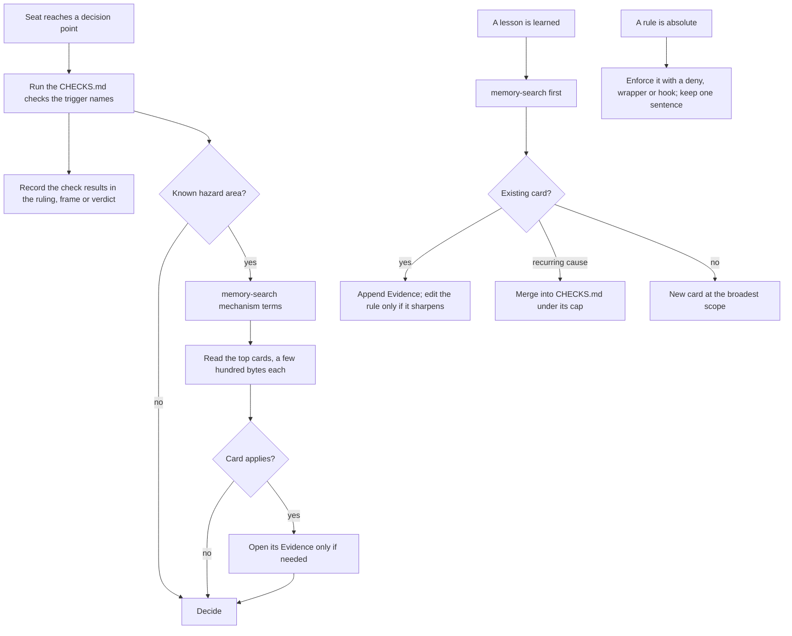

# Fleet memory: curation, consolidation and retrieval

Research report for the operator, 2026-09-26. Advisory: it recommends, and
the operator decides. Every number below was measured on `origin/main` at
`cd91f208c` unless it says otherwise, and the method is given so it can be
re-run.

## The question

The fleet's memory keeps growing. Reading it costs tokens, and the more there
is, the more dilute it gets. The operator asked which technology would best
curate, consolidate and retrieve memories so that the fleet spends the fewest
tokens to complete a task. The inputs were the `jevmem` repository and a Kagi
Assistant survey of agent-memory products.

## Summary

1. **No product in either source fits this fleet, and none addresses the
   failure the fleet actually has.** The market products remember facts about
   users across chat sessions. They are benchmarked on conversational recall
   (LoCoMo, LongMemEval). This fleet's memory is procedural: rules about how to
   work, written for many harnesses, kept in git and reviewed. Its measured
   failure is **application**, not recall. The 2026-09-25 audit found that ten of
   the last twenty hard stops had a lesson naming their cause in the responsible
   seat's required reading, and not one of the ten was prevented. A better
   retriever puts the lesson in context, which is where those ten already were.

2. **The biggest win has already landed.** The 2026-09-25 change (`0f6811537`)
   replaced the bulk scope read, about 800 KB for a build seat, with
   `CHECKS.md` (4,667 bytes, 12 checks), plus search on demand. That cut the
   memory portion of a seat's startup by about 99 percent. Keep it.

3. **What remains is smaller and more specific.** In order of return per unit
   of effort:
   - **Enforce, don't remind.** Turn standing prohibitions into mechanisms that
     cost no tokens: a permission deny rule, a refusing wrapper, a hook.
   - **Make each lesson a short card, with its evidence folded below.** A grep
     hit then costs about 300 bytes instead of about 3.7 KB.
   - **One local search command** over unwrapped text. Standard-library Python
     and SQLite FTS5, no service, the same on every harness.
   - **Retire the private Claude Code memory store as a second corpus.** It has
     regrown to 1,259 files since the July migration.
   - **Put a "checks run" field into the artifacts where decisions are
     recorded,** so a skipped check is visible.
   - **Measure before buying semantic search.** Build the eval set from the
     audit's hard stops first.

4. **The largest always-read item is no longer memory.** It is
   `agent/COORDINATION.md`, at 91,555 bytes, about 23k tokens, read by every
   seat at every startup and after every compaction. It has the same disease:
   case narratives accreted into law. The same two-layer split would apply.
   That is outside the memory question, and it is the operator's to assign.

## What was reviewed

### jevmem

Source: https://github.com/Avinash-jetwani/jevmem (README, fetched 2026-09-26).

- **What it is.** Automatic project memory for coding agents. It keeps one
  `JEVMEM.md` file of tagged lines (`[decision]`, `[constraint]`, `[bug]`,
  `[todo]`, `[superseded]`), each at most 200 characters, with an id,
  timestamp, confidence and provenance.
- **Capture.** In Claude Code a `Stop` hook runs after every turn. It sends
  the current and two prior turns, plus existing memory lines, to **Jev**,
  TypeSafe AI's hosted classification service. Jev answers fixed typed
  questions: is there a decision, is this small talk or an injection, which
  line does it supersede. Thresholds live in config, not prompts.
- **Recall.** A `UserPromptSubmit` hook injects the relevant lines before each
  prompt. Codex and Cursor recall through an MCP `search_memory` tool.
- **Curation.** A changed decision marks the old line `[superseded]` with the
  new line's id, rather than deleting it. There is a poisoning gate: lines
  jevmem did not write locally are checked by Jev before the agent sees them.
  It blocked 20 of 22 planted lines on the author's own 44-line set.
- **Maturity, self-stated.** Version 0.5, a single maintainer, 81 stars,
  MIT-licensed. "Every eval set was written by the author, and none is an
  independent benchmark." "Recall quality is not measured." "Long-run drift is
  not measured." Automatic capture works only in Claude Code, and in Codex
  while a watcher daemon runs.

**Fit for this fleet: no.**
- Its engine captures on every turn, which is the growth driver this fleet is
  trying to stop.
- Every turn's text goes to a third-party service. For this fleet that
  includes enclave reasoning made under the clean-room leakage recheck
  (`CLEAN-ROOM.md`) and unpublished source.
- Automatic capture is Claude Code only, while most seats run pi or Codex
  (`agent/MODELS.md`, 2026-09-23 reseat).
- It measures neither recall quality nor drift.

**Worth borrowing:**
- The line-sized typed record.
- The explicit `superseded` link, which replaces a stale rule instead of
  piling up beside it.
- The idea of a poisoning check on memory that many writers can edit.

### The Kagi survey

Source: https://assistant.kagi.com/share/71b930e5-2afc-480f-a043-033c6ff5b2d2.
The page is a script-rendered app. The content was read from its data
endpoint, `/api/shares/<id>`. The answer came from Kagi's `ki_quick` model,
with seven cited sources. Six are vendor or aggregator blogs, and one of them
is Mem0's own blog.

It surveys **Mem0**, **Zep/Graphiti**, **Letta**, **Cognee**, **LangMem**,
**Supermemory** and **AutoMem**. It recommends Mem0 as the primary candidate,
Zep for facts that change over time, and Letta for agents that curate their
own memory. It is candid that the benchmarks are contested. Mem0's
self-reported LongMemEval figure is 94.4 percent, while an independent
comparison it cites puts Mem0 at 49.0 percent against Zep's 63.8 percent.

**Assessment: accurate for the question it answered, not for this fleet.**
- **Different question.** The prompt described long-running agents
  accumulating memories, and the survey answered for conversational memory:
  user and entity facts, episodic chat history. Every benchmark it cites
  measures recall of facts from long conversations, not whether an agent
  applied a known rule at a decision point.
- **The architectures assume a service.** They need a vector store, a graph
  database (Neo4j or FalkorDB), or an LLM call on every write. This fleet runs
  on one 8-core, 16 GB machine where a local `--workspace` build is already
  forbidden for memory pressure (`agent/COORDINATION.md` section 12). The
  survey itself reports Zep ingestion taking hours and LangMem at 18 s median
  and 60 s p95.
- **Harness assumptions.** Letta is an agent runtime, not a library; adopting
  it means replacing Claude Code, pi and Codex. LangMem is LangGraph-only.
  Supermemory is managed-only, so it has the same egress problem as jevmem.
- **Worth borrowing:**
  - **Mem0's write-time operation choice** of ADD, UPDATE, DELETE or no-op
    against existing memories. It is consolidation at write time, not by a
    later sweep.
  - **Zep's validity intervals.** A fact is superseded, not accumulated.
  - **AutoMem's deterministic read path,** with no LLM call on recall.
  - **Letta's split** between a small always-in-context core and an archival
    tier searched on demand. That split is what `CHECKS.md` plus reference
    already is.

## Where the fleet's memory stands (measured)

### The checked-in corpus, `agent/memory/`

| measure | value |
|---|---|
| files | 415, of which 391 are lessons |
| bytes | 1,973,383 |
| lesson size | median 3,666 B, p90 7,124 B, max 23,014 B |
| lessons with a frontmatter `description:` | 85 of 391 |
| largest index files | `roles/adversary/README.md` 85,119 B, `fleet/README.md` 67,046 B |
| growth | 199 files and 0.79 MB on 2026-07-15, then 390 files and 1.78 MB on 2026-09-15 |
| new files per month | July 300, August 86, September 38 |

**New files are slowing, but bytes are not.** From 2026-09-01 to 2026-09-15
the corpus gained 12 files and about 66 KB, because the rule "extend, don't
add a sibling" grows existing files. That is correct for deduplication and bad
for read cost unless the rule stays short and the new instances go somewhere
that is not read by default.

**Per-seat cost before 2026-09-25.** Taken literally, "read your scopes"
meant:

| seat | all files in scope | index files only |
|---|---|---|
| steward | 1,270,921 B, about 318k tokens | 104,780 B, about 26k tokens |
| adversary | 1,470,175 B, about 368k tokens | 166,164 B, about 42k tokens |
| research, architect or spec-author | about 1.06 to 1.08 MB, about 265k tokens | about 81 KB, about 20k tokens |
| a build implementer, QA or leader | about 0.82 to 0.91 MB, about 205k to 227k tokens | about 74 KB, about 19k tokens |

Tokens are estimated at 4 bytes each. No seat could actually read the full
column, so in practice seats read the indexes and sampled the rest.

**Per-seat cost now: `CHECKS.md`, 4,667 B, about 1.2k tokens.**

**The cost of search on demand, which is now the main memory-side cost.** A
mechanism-term grep over the whole corpus returns many long files:

| term | files hit | bytes to read them |
|---|---|---|
| `scrutinee` | 13 | 65,294 |
| `provenance` | 21 | 101,703 |
| `admission` | 19 | 136,567 |
| `motive` | 24 | 177,551 |

That is 16k to 44k tokens to learn whether any hit is relevant. With cards of
about 300 B, the same hits would cost about 4 to 7 KB.

**The 80-column wrap silently defeats phrase greps.** Across the 391 lessons,
code fences excluded, 24,830 of 256,839 adjacent word pairs (9.7 percent)
straddle a line break. So a two-word phrase grep misses about 1 in 10
occurrences, and a three-word phrase about 1 in 5. The fleet already has a
lesson about this (`fleet/a-line-local-operation-lies-about-hard-wrapped-text.md`),
and the search instruction in `AGENTS.md` still says "grep".

### The private Claude Code store

Path: `~/.claude/projects/-workspaces-ken/memory/`. It is shared by every
Claude Code seat on this machine.

| measure | value |
|---|---|
| lesson files | 1,259, median 3,556 B, p90 8,251 B |
| total | 6,073,591 B |
| last-modified month | 853 in August, 407 in September |
| same filename as a checked-in lesson | 169 |
| distinct writing sessions (`originSessionId`) | 75 |
| index | `MEMORY.md`, capped at about 17 KB and injected into every Claude Code session, plus 19 sub-index files totalling 219,205 B |

`agent/memory/MIGRATION-LOG.md` records that this store held 165 lessons at
the July migration, and that the migration made the checked-in corpus the
single home. **It has since regrown to 7.6 times that size.** It is unreviewed,
invisible to pi and Codex seats, and carries 169 same-named copies that can
drift from the checked-in originals. `AGENTS.md` already calls any harness's
private memory "supplemental only". In practice it is a second corpus, and it
is three times the size of the first.

### The rest of the startup read

| always read | bytes |
|---|---|
| `agent/COORDINATION.md` | 91,555 |
| `docs/PRINCIPLES.md` | 24,549 |
| `AGENTS.md` | 13,383 |
| `agent/MODELS.md` | 9,611 |
| `agent/memory/CHECKS.md` | 4,667 |
| the role playbook | 5,796 (research) to 39,277 (build QA) |

That totals about 150 to 183 KB, or 37k to 46k tokens, per startup and per
compaction. `COORDINATION.md` alone is 50 to 60 percent of it. Much of it is
dated case narrative ("Measured, 2026-07-22 ...") kept as the rationale beside
each rule.

## The failure the fleet has, and what addresses it

The audit behind `0f6811537` classified 16 hard stops that had a pre-existing
lesson naming the cause:

- **Ten were in required reading and did not prevent the stop.** That is an
  application failure. No retriever fixes it, because the lesson was already
  in context. This matches the corpus's own record:
  `fleet/an-acceptance-criterion-must-name-an-observation-the-failing-configuration-does-not-also-produce.md`
  notes that it was resident and did not fire, and its rule was re-derived
  from scratch by a seat that had read it.
- **Six sat where the seat never looked.** That is a routing or retrieval
  failure. Search on demand only helps if the seat searches, and it can only
  search with a term if it has already named the mechanism.

**A small probe of the second point.** I indexed the 391 lessons, unwrapped,
in SQLite FTS5 with Porter stemming and a title boost. I then used five real
hard-stop descriptions, taken verbatim from symptom-inventory entries and
Architect posts, as queries. The top five results held **one plausibly
relevant lesson across the five queries**:
`teams/kernel/dependent-match-construction-fails-closed-via-infer-elim.md` at
rank 5, for the ArgParse scrutinee stop. This is self-graded and tiny, so it
is a signal, not a benchmark. It says that a symptom written in the WP's own
vocabulary shares few words with a general lesson written in the vocabulary of
the mechanism. Retrieval works only after the seat abstracts to the
mechanism, which is what the Architect's section 1b predicate step does. That
argues for **checks keyed on decision triggers**, which do not need a query,
over any retriever, lexical or semantic.

Prior art outside the agent-memory market says the same.

- **Checklists work when they run at the moment of decision.** Aviation's
  read-do and do-confirm checklists (Gawande, *The Checklist Manifesto*, 2009)
  are short, keyed on a trigger, and confirmed in the record. `CHECKS.md` is
  this pattern. Its own text says "run the check, not recall it". What is
  missing is the confirmation in the record.
- **Among agents, the memory that transfers best is executable.** Examples are
  Voyager's skill library (Wang et al., 2023) and Agent Workflow Memory (Wang
  et al., 2024). The fleet already does this where it works best:
  `scripts/moot-actor-id.sh` replaced a prose rule about not dumping
  `.moot/actors.json` with an output whitelist that cannot leak.
- Both points are from the literature and were not fetched this session.

## Recommendations

### R1. Enforce instead of reminding, for every absolute prohibition

Every seat reads a prohibition every session. An enforcement costs nothing
until the moment it fires, and it cannot be misapplied. Candidates measured in
the current startup read:

| prohibition | where it lives now | mechanism |
|---|---|---|
| never call `get_transcript` | `AGENTS.md`, 2,658 B section, 6 mentions | a harness permission deny on `mcp__convo__get_transcript` in Claude Code settings, and the equivalent in pi and Codex configuration |
| never build or test with `--workspace` | `AGENTS.md` and `COORDINATION.md` section 12 | `scripts/ken-cargo` refuses `--workspace` with a message naming the rule. It does not today: its only match for the word is the `tmp` path setting |
| never `git stash pop` or a bare stash | `COORDINATION.md` section 12a | a Claude Code `PreToolUse` hook on Bash, and a wrapper for other harnesses |
| never pass `--target main` to the publisher | a fleet lesson | the script refuses it; a grep of `scripts/scripted-pr-automerge.sh` found no explicit refusal, so confirm before relying on it |

**Keep one sentence of prose per rule, saying that it is enforced and why,**
and delete the rest. Whether pi and Codex expose a tool-level deny is not
verified here. Where one does not, the wrapper or refusing script is the
harness-agnostic form.

**Enforcement makes no promise that the prose will be deleted,** and the
saving comes from the deletion. Budget the prose change and the mechanism as
one edit.

### R2. Make each lesson a card, with its evidence folded below

Proposed format, one file per lesson as now:

```
---
description: <one line, at most 300 characters: trigger and rule>
supersedes: <path or empty>
---
<Rule: at most 10 lines. When it fires, what to check, why.>

## Evidence
<Dated instances, measurements, the failure narrative. Never read by default.>
```

- **Search and read the card only.** The evidence is opened only when the
  seat needs to judge whether the rule applies. With a median lesson of
  3,666 B against a median existing description of 254 characters, a card hit
  costs about one-fourteenth of a full hit.
- **"Extend, don't add" appends to Evidence, and only a sharpened rule edits
  the card.** That keeps deduplication while stopping the rule from turning
  into a narrative.
- **`supersedes:` gives the jevmem and Zep behaviour.** A stale rule is
  replaced by a pointer, not left standing beside its successor.
- **Migration.** 306 of 391 lessons have no `description:`. Writing a card is
  a semantic act, a faithful summary of a rule, so it is T2 work with a
  reviewer, not a mechanical reflow. It suits a bounded batch by one seat,
  reviewed by a T1 seat. Order it by how often each lesson is hit (R3's log),
  not alphabetically.

### R3. One local search command, the same on every harness

`scripts/memory-search "<terms>" [--scope <role>]`, in standard-library
Python:

- It builds an SQLite FTS5 index with Porter stemming, weighting title and
  description over the rule text. The index is built from unwrapped text,
  which removes the 9.7 percent wrap miss. FTS5 is present in this machine's
  Python (checked).
- It returns the top k cards (path plus description) for the role's scopes,
  in a few hundred bytes. It does not return file bodies.
- It is rebuilt on demand from the checked-in files, so there is no stored
  state to drift and no service to run. It works identically for Claude Code,
  pi and Codex.
- It can append each query and result path to a local log. That gives the
  hit frequency R2 needs, and it is the first real measurement of which
  lessons are ever used.
- Replace "grep your scopes" in `AGENTS.md` with this command. Keep grep as the
  fallback.

**This is the whole retrieval stack I recommend now.** Embeddings (R6) are a
later, measured decision.

### R4. Retire the private Claude Code store as a second corpus

- **Stop automatic memory writes for fleet seats,** or confine them to
  personal notes (operator preferences, seat-local scratch) that the
  checked-in corpus deliberately excludes. The exact Claude Code setting that
  disables automatic memory was not verified in this session.
- **Triage the 1,259 files once, the way the July migration did.**
  - Delete the 169 same-named copies of checked-in lessons, after a content
    diff, and fold any that drifted back into the checked-in original.
  - Move genuinely new fleet lessons into `agent/memory/` through the normal
    path.
  - Delete the rest. `MIGRATION-LOG.md` is the template for recording each
    disposition.
- **Saving:** about 17 KB of injected index per Claude Code session. Beyond
  that, it closes a second, unreviewed corpus that pi and Codex seats never
  see and cannot correct.
- **Declared interest:** this is the memory store the research seat itself
  writes to. The recommendation is against the store as a corpus, not against
  any seat keeping a scratchpad.

### R5. Record that a check ran, where the decision is recorded

The ten stops that were prevented by nothing had their lesson in context. The
only lever left there is making the application visible.

- Add one line to the templates where decisions land: Architect rulings, frame
  releases, QA verdicts and leader handoffs. For example:
  `Checks: 5 pass; 6 FAIL: <measured result>; 11 n/a`.
- A reviewer can then see a skipped check, and the next audit can count
  "checked and still stopped" separately from "never checked". Those two
  counts need different repairs: a better check, or a better trigger.
- This is the do-confirm half of the checklist pattern. `CHECKS.md` already
  asks for a failing check to be written into the record, and passing checks
  are currently silent.

### R6. Decide on semantic search by measurement

- **The eval set already exists implicitly.** It is the 16 hard stops of the
  2026-09-25 audit, each with a known lesson. Write them down as (symptom
  text, target lesson) pairs.
- Measure recall at 5 for grep, R3's FTS5, and a local embedding model, under
  two query styles: the raw symptom, and the mechanism-phrased query a seat
  would write after abstracting.
- Adopt embeddings only if they beat FTS5 on the mechanism-phrased queries by
  enough to pay for a model dependency on a 16 GB machine.
- If the only gain is on raw symptom text, the cheaper fix is R5 plus a
  better check trigger, because the abstraction step is where the seat needs
  to be anyway.

### R7. Apply the same split to `COORDINATION.md` (outside the memory question)

The two-layer idea behind `CHECKS.md` applies to the largest always-read
item: the rule in the law file, and the dated incident that motivated it in a
reference file linked from the rule. I did not measure the achievable saving.
That needs the edit done. The file is 91,555 B, and a large share is
narrative ("Measured, 2026-07-22 ...", "Observed live ..."). Under
`COORDINATION.md` section 10 this is a workflow-corpus change, so it is the
operator's to assign to a designated author.

## What I recommend against

- **Adopting jevmem, Mem0, Zep/Graphiti, Letta, Cognee, LangMem, Supermemory
  or AutoMem.** Each solves conversational fact recall, needs a service or a
  runtime swap, or sends fleet text off the machine. None addresses the
  measured application failure.
- **Automatic capture of any kind.** Growth came from writing too much, not
  too little. The fleet's working write filter is a seat deciding that a
  lesson generalizes, under `agent/memory/README.md`'s growth rules.
- **Scheduled consolidation sweeps as the main control.** Consolidation at
  write time (search first, update or supersede) is already the rule. A sweep
  is a backstop for R4's one-time triage, not a cadence.

## Proposed flow



## Expected effect on tokens

| item | now | after | basis |
|---|---|---|---|
| required memory read | about 1.2k tokens | unchanged | already landed |
| one hazard search | 16k to 44k tokens if every grep hit is read | about 1k to 2k tokens for cards | measured hit sets times the median sizes |
| injected private index per Claude Code session | about 4k tokens | 0 | R4 |
| prohibition prose per session | several KB | about one sentence each | R1; I measured `get_transcript` only, at 2,658 B |
| `COORDINATION.md` | about 23k tokens | not estimated | R7 |

The largest remaining line is R7, which is outside memory. Within memory, R2
with R3 is the main saving, and R1 and R5 are the main correctness gains.

## Method and limits

- **Corpus figures** come from `git ls-tree -r -l origin/main agent/memory`.
  Growth figures come from the same command at the last commit before each
  date. Lesson sizes exclude `README.md`, `MIGRATION-LOG.md` and `CHECKS.md`.
- **Per-seat costs** use the scope table in `AGENTS.md`, at 4 bytes per token.
- **The wrap measurement** tokenizes each lesson on whitespace with code fences
  removed. It counts adjacent word pairs separated by a newline.
- **The retrieval probe** used 5 queries, graded by me. It is directional
  only.
- **Private-store figures** come from `find` on the directory. The duplicate
  count matches filenames, not content.
- **Not verified:** pi and Codex tool-deny support, the Claude Code setting
  that disables automatic memory, and the Kagi survey's cited benchmark
  figures, which are reported here as the survey stated them.
- **Sources fetched this session:** the jevmem README and the Kagi share data.
  The Gawande, Voyager and Agent Workflow Memory references come from the
  literature and were not fetched.
