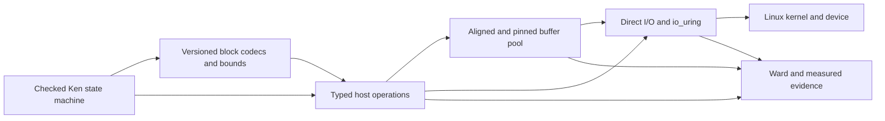

# TigerBeetle-style systems performance in Ken

**Research status:** advisory, not an architecture or language-design ruling

**Audit baseline:** `origin/main @ 8465d03f02f6` (2026-08-21)

**Prepared for:** the operator and Steward

## Executive assessment

A TigerBeetle-shaped transaction and replication state machine can plausibly be
written and verified in Ken. A TigerBeetle-shaped whole storage engine, written
entirely as ordinary checked Ken source and directly controlling aligned mutable
memory, `O_DIRECT`, `io_uring`, atomics, or an NVMe device, cannot be built in
Ken today.

This is partly unfinished implementation and partly deliberate language design.
Ken already has fixed-width integers through 64 bits, explicit effects and
capabilities, positioned bounded-buffer I/O, runtime-owned resources, capacity
profiles, target manifests, and a native host boundary. It deliberately does
not expose the physical representation of ordinary values, raw addresses,
pointer arithmetic, arbitrary mutation, public atomics, or affine types. The
process, socket, readiness, and asynchronous-I/O programs are also unfinished.

The most compatible target is a hybrid:

- checked Ken owns transaction invariants, batch validation, persistent-state
  transitions, codecs, bounds, capability policy, and the logical request state
  machine;
- the audited Rust host owns aligned and pinned storage, direct-I/O setup,
  `io_uring` mappings and atomics, and device interaction; and
- Ward or another measured evidence layer checks temporal properties such as
  terminal completion, cancellation, resource lifetime, allocation behavior,
  and latency.

Most of the required capability should therefore arrive as typed host protocols
and explicit representation types, not as a general raw-memory language. The
smallest plausible language additions are native 128-bit integers and an
explicit fixed-representation block abstraction that remains distinct from
ordinary semantic records. Aligned startup pools, direct files, and `io_uring`
are primarily catalog, runtime, and target-manifest work.

This conclusion agrees with
[ADR 0012](../docs/adr/0012-systems-programming-suitability.md): there is no
intrinsic barrier to systems-adjacent leaf components, but Ken is not intended
to replace Rust as a general driver or operating-system implementation
language.

## 1. What the TigerBeetle techniques actually are

The motivating article is a useful explanation, but several phrases should not
be carried into a language contract literally.

### 1.1 Fixed records and separately aligned transfer buffers

TigerBeetle's `Account` and `Transfer` records are each asserted to have size
128 bytes and alignment 16. They are not themselves cache-line- or page-aligned
records. Separately, the message-pool allocation path aligns larger buffers to
4096 bytes. Since 128 divides common 512- and 4096-byte transfer granularities,
a block can hold an integral number of records; 128 is not a multiple of either
512 or 4096.

The distinction is important. A durable record schema needs fixed field widths,
o accidental padding, explicit byte order, and versioning. A direct-I/O buffer
needs an address, offset, and length satisfying the active filesystem or device
constraints. They are related, but they are not one layout property.

### 1.2 Startup allocation followed by a frozen allocator

TigerBeetle allocates bounded working storage during initialization and then
disables further allocation. This removes allocator latency and makes capacity
failure an admission-time concern rather than a surprise in the hot path. It is
not merely an optimization annotation: every later code path must either reuse
provisioned memory or reject work under an explicit bound.

### 1.3 `O_DIRECT`, `io_uring`, and DMA

TigerBeetle uses `O_DIRECT` so its storage path bypasses the Linux page cache,
and uses `io_uring` for asynchronous submission and completion. `O_DIRECT` does
not bypass the kernel. Ordinary userspace code also does not directly command
an NVMe DMA engine through `io_uring`: it supplies suitably aligned memory to
the kernel, and the kernel and device arrange mapping and transfer.

That qualification gives Ken a safer design opportunity. Ken does not need to
expose physical addresses or generic DMA primitives to obtain the ordinary
benefits of direct I/O. It needs a host facility that owns suitable memory,
checks the active alignment contract, retains the memory until terminal
completion, and exposes bounded operation tokens to Ken.

A userspace NVMe stack such as an SPDK- or VFIO-shaped design is a different,
much larger target. It adds huge or pinned pages, IOMMU ownership, MMIO queue
registers, device-visible addresses, cache-coherence rules, and memory barriers.
It should not be conflated with kernel-mediated `O_DIRECT` plus `io_uring`.

### 1.4 Tail latency is a system property

Fixed layouts, batching, startup allocation, single-issuer execution, direct
I/O, and bounded queues all improve predictability. They do not make a latency
quantile a theorem of the source language. The scheduler, filesystem, kernel,
firmware, device, CPU cache, thermal behavior, and workload remain part of the
observation. Ken can prove that a program respects the profile's preconditions;
the profile's actual latency must be measured and reported honestly.

## 2. Ken's useful foundations

Ken is not starting from an application-only runtime. Several current contracts
are directly useful.

### 2.1 Fixed-width arithmetic and explicit overflow

The surface includes signed and unsigned native fixed-width integers from 8
through 64 bits, with explicit conversions and overflow behavior
([numbers](../spec/30-surface/35-numbers.md)). This is suitable for file offsets,
wire fields, lengths, flags, checksums, and most host ABI facts. TigerBeetle uses
128-bit identifiers and arithmetic extensively, so the missing 128-bit tier is
a concrete gap rather than a general absence of machine integers.

### 2.2 Capability- and effect-scoped host operations

Ken represents I/O as explicit effects under supplied capabilities rather than
ambient syscalls. The native effect contract and target manifest already
provide the right place to bind operation availability and target ABI facts
([FFI and I/O](../spec/30-surface/38-ffi-io.md),
[native effect contract](../docs/adr/0018-native-effect-execution-contract.md),
[capability evolution](../docs/adr/0019-capability-evolution-and-process-admission.md)).

A direct file, registered-buffer pool, or asynchronous ring can therefore be a
constructor-private resource with an allowlisted operation family. Ken need not
acquire a generic syscall escape hatch.

### 2.3 Bounded positioned-buffer I/O

The current I/O surface specifies fixed-capacity, runtime-owned buffers,
initialized-window tracking, spans tied to their originating acquisition, and
positioned `readAt` and `writeAt` operations
([FFI and I/O §1.7](../spec/30-surface/38-ffi-io.md)). The host implementation
already reads into and writes from the same hidden `Vec<u8>` region in the
synchronous path. Converting a span to immutable `Bytes` freezes it by copying.

This is a useful safe substrate, but not yet a direct-I/O buffer:

- acquisition dynamically allocates a `Vec<u8>`;
- `Vec<u8>` does not promise page or device alignment;
- the memory is not pinned or registered;
- file acquisition does not establish an `O_DIRECT` contract; and
- freezing performs an explicit copy.

The implementation evidence is in
[`effect_v1.rs`](../crates/ken-host/src/effect_v1.rs); the remaining PX8 and
native-handle work is visible in
[`IMPLEMENTATION-PROGRESS.md`](../docs/program/IMPLEMENTATION-PROGRESS.md).

### 2.4 Resource profiles and loud exhaustion

Ken already treats finite in-process capacity as a resource profile rather than
part of value semantics. A runtime may use regions, tracing, reference counting,
or process-lifetime allocation, but exhaustion of a declared finite limit must
fail loudly
([capacity](../spec/40-runtime/44-capacity.md)).

This can describe the size and count of startup pools. It does not yet establish
that the compiler and runtime perform no hidden allocation after startup.

### 2.5 Runtime-enforced resource lifetime

Ken will not introduce affine or linear types for V1. Resource handles are
ordinary copyable Ken values; Rust enforces the actual move/lifetime discipline,
generation checks make stale copies return `Closed`, and Ward carries the
lifecycle evidence
([ADR 0021](../docs/adr/0021-resource-lifetime-and-ward-delegation.md)).

That is directly applicable to asynchronous requests and registered buffers. A
copyable token may name an operation, while the runtime alone owns the pinned
address and refuses release or reuse until terminal completion.

### 2.6 Total handlers under a runtime loop

The checked core is total. A forever-running service is represented as total
per-message handlers plus a runtime-owned loop
([termination §4](../spec/40-runtime/43-termination.md)). A single-threaded
transaction engine therefore fits semantically as a deterministic state step:

```text
step : State -> Event -> Result Error (State, List Command)
```

The obstacle is not the state-machine shape. It is the unfinished process,
socket, readiness, and asynchronous-I/O substrate that supplies events and
executes commands.

## 3. Technique-by-technique feasibility

| Technique | Ken today | Principal limitation | Compatible route |
|---|---|---|---|
| Ledger and batch invariants | Feasible | Library and proof work | Ordinary checked Ken |
| Replicated-state-machine logic | Semantically feasible | Network and event-loop substrate unfinished | Total handlers under a runtime loop |
| Fixed bounds and batch arithmetic | Feasible | Does not imply contiguous physical storage | Refinements plus resource profiles |
| Native fixed-width records | Partial | Integers stop at 64 bits | Add `Int128` and `UInt128` |
| Exact record size and field offsets | Not expressible for ordinary values | Representation is private | Explicit versioned block/codec type |
| Cache-line, sector, or page alignment | Not expressible in source | No aligned allocation or address contract | Runtime-owned aligned pool plus manifest |
| No allocation after startup | Not guaranteed | Hidden compiler/runtime allocation remains possible | Measured or certified deployment profile |
| Synchronous positioned I/O | Partly present | Full PX8 path unfinished | Complete existing bounded-buffer path |
| `O_DIRECT` | Not present | Alignment and open-mode contract missing | Typed `DirectFile` capability |
| `io_uring` | Not present | Ring memory, atomics, cancellation, lifetime | Closed single-issuer host facility |
| Registered-buffer zero-copy | Not present | Pinning and terminal-completion ownership | Runtime pool plus generation-checked tokens |
| Raw userspace NVMe driver | Impossible in ordinary Ken today | MMIO, IOMMU, DMA, barriers, raw addresses | Later device-specific audited facility |
| Predictable latency quantiles | Not provable from source | Hardware and OS dependent | Target-specific measured attestation |

## 4. What is difficult or impossible today

### 4.1 Ordinary values have no observable machine layout

Ken separates semantic values from their in-process representation. Values are
immutable, and no allocation slot, address, allocation order, or physical
provenance exists in Ken's semantics
([values §§2–3](../spec/40-runtime/41-values.md)). Canonical serialization is
stable where specified; the runtime representation remains private.

Consequently an ordinary Ken record cannot promise:

- a size of exactly 128 bytes;
- a particular field offset;
- the absence or value of padding;
- alignment to 16, 64, or 4096 bytes;
- that its in-memory bytes equal its disk encoding; or
- that two adjacent records are physically contiguous.

This is a deliberate portability and abstraction property. Making every record
expose a backend ABI would let one machine representation leak into value
meaning.

### 4.2 Ken source does not hold mutable addresses

`Bytes` and persistent collections are immutable. The buffer API exposes opaque
handles and bounded spans, not mutable slices, raw pointers, address casts, or
pointer arithmetic. That rules out implementing a raw ring protocol, allocator,
MMIO register bank, or DMA descriptor queue in ordinary Ken source.

The restriction does not inherently require copies. A runtime can retain an
address and perform a checked operation at a validated offset while Ken sees
only a handle. It does mean the unsafe mechanics belong behind the host
boundary.

### 4.3 Allocation freedom is not a language effect

A resource profile can bound explicit pools, but Ken does not currently expose
an allocation effect or a whole-program certificate proving that no runtime,
collection, closure, big-integer, error, or code-generation path allocates after
initialization. Ordinary persistent updates are also a poor hot-path substrate
for allocation-free in-place tables.

A claim such as “no allocation after startup” would therefore be over-stated if
attached only to source syntax. It initially belongs as a toolchain/runtime
profile with an allocator trap or counter proving the property on the target
artifact. A stronger static guarantee would require an explicit cost/resource
analysis spanning elaborated program and runtime lowering.

### 4.4 Async zero-copy is primarily a lifetime problem

Submitting a buffer to `io_uring` is not the difficult part. After submission,
the buffer cannot be moved, freed, unregistered, repurposed, or incompatibly
mutated until the terminal completion state is known. Cancellation does not end
that obligation: the cancellation completion can race the original operation,
and an “already running” result still requires the original terminal evidence.

Since Ken handles are copyable, the type system cannot consume the last alias.
The compatible enforcement is:

- the runtime owns the storage and its pin/registration state;
- Ken holds an opaque `(slot, generation)`-shaped token;
- every operation checks the current generation and state;
- cancellation records an intermediate state rather than releasing storage;
- only reconciled terminal completion permits reuse; and
- Ward observes no reuse-before-terminal and no leaked terminal resources.

The existing advisory design in
[Linux ABI II §L2-4](linux-abi-ii-work-program-proposal.md) already selects this
shape: a constrained copy-based V1, followed by registered buffers and fixed
files only after the request-state semantics stabilize.

### 4.5 The required host operations are unfinished

The current implementation has a useful synchronous descriptor and buffer
floor, but positioned I/O still has an active completion blocker, and processes,
sockets, readiness, and timeouts remain draft program nodes. There is no current
`io_uring` operation family. A generic `foreign` declaration in the language
spec does not substitute for a production native host protocol with capability
admission, target identity, interpreter/native observations, and lifetime
checks.

This makes an all-Ken implementation unavailable even before questions of
physical layout arise.

### 4.6 Native 128-bit values are missing

TigerBeetle uses 128-bit identifiers and arithmetic throughout its public record
schema. Ken could represent such values as pairs of `UInt64` or as arbitrary
precision `Int`, but neither is an exact native `u128` ABI/layout promise.
Adding native 128-bit integers is a narrow, feasible language/runtime extension.
It still would not make an ordinary record a 128-byte record.

### 4.7 Raw device access is a distinct and harder boundary

A kernel-mediated direct-I/O path can keep addresses entirely private to the
host. A userspace device driver cannot. It needs some combination of:

- controlled device acquisition and IOMMU ownership;
- pinned or registered memory and device-visible mappings;
- MMIO queues and doorbells;
- volatile access and ordering barriers;
- cache-coherence and direction rules;
- interrupt or polling integration; and
- exact device-family lifetime and reset semantics.

The compatible Ken direction is not a general pointer surface. It is a selected,
typed device-family protocol over runtime-owned mappings, as proposed in
[Linux ABI II §L2-8](linux-abi-ii-work-program-proposal.md). Generic DMA or
ambient `/dev/mem` should remain unavailable.

## 5. Feasible changes

The following are advisory design candidates. Exact syntax and ownership remain
language and architecture decisions.

### 5.1 Add native `Int128` and `UInt128`

This is the clearest genuine scalar-language gap. The addition should define:

- checked, wrapping, and saturating arithmetic;
- explicit widening and narrowing conversions;
- canonical byte encodings;
- native lowering where supported and a specified fallback otherwise; and
- target-manifest ABI behavior.

It is relatively contained compared with exposing physical layout generally.

### 5.2 Add an explicit representation block, not `repr` on every record

Introduce a type distinct from ordinary semantic records, conceptually:

```text
Block byte_count alignment endianness schema
```

An illustrative account interface might be:

```text
AccountV1Block : Block 128 16 LittleEndian AccountV1
encodeAccount : Account -> AccountV1Block
decodeAccount : AccountV1Block -> Result DecodeError Account
```

The exact form is not a proposed syntax ruling. The important separation is:

- `Account` remains a portable semantic value;
- `AccountV1Block` is an explicitly versioned durable or foreign
  representation;
- encode/decode owns padding and byte order;
- block length and field offsets are reasonable-from in Ken; and
- actual address alignment is supplied and checked by the runtime.

Ken could prove encoded size, field bounds, non-overlap, deterministic padding,
round trips, batch divisibility, and offset arithmetic without exposing the
address of the block.

A specialized packed-block or arena API is preferable to making every Ken value
physically inspectable.

### 5.3 Re-back `Buffer` with bounded aligned startup pools

Extend the existing resource rather than inventing raw slices:

1. Provision one or more pools at process initialization.
2. Give each pool a fixed byte capacity, maximum buffer count, and requested
   alignment.
3. Allocate or map the backing storage once, then freeze the pool policy.
4. Lend generation-checked buffer handles and bounded spans.
5. Refuse exhaustion or unsupported alignment with typed errors.
6. Never silently fall back to an ordinary heap buffer when the profile requires
   direct I/O.

The runtime may use `posix_memalign`, an aligned Rust allocation, `mmap`, or a
later registered-buffer mechanism. That implementation choice should remain
private as long as the observable alignment and lifetime contract is met.

### 5.4 Add a typed direct-file capability

A `DirectFile`-shaped resource should bind:

- the authorized file or scoped root;
- read/write/durability rights;
- the actual address, offset, and length constraints;
- filesystem and target identity;
- supported positioned operations; and
- explicit fallback policy.

The constraints should come from target/facility probes where available, not
from a universal assumption that every device requires 4096 bytes. A mismatch
must be a typed refusal. If an application requires direct semantics, the host
must not silently reopen without them.

### 5.5 Implement `io_uring` as a closed host protocol

The existing Linux ABI II advisory gives a suitable staged design.

Version 1 should use:

- one runtime issuer and one Ken invocation at a time;
- runtime-owned ring mappings, queue indices, SQEs, CQEs, and atomics;
- opaque ring, request, and completion tokens;
- an allowlist of operation and flag combinations;
- explicit feature probing and restricted-ring policy;
- bounded copy-in/copy-out buffers; and
- a request state machine that retains resources through terminal completion.

There should be no arbitrary SQE constructor and no fallback that silently
changes cancellation, completion, or durability semantics.

Version 2 may add registered buffers and fixed files after V1 stabilizes. It
requires a runtime-owned pinning pool, memory-lock accounting, explicit
registration/replacement/unregistration states, and Ward observations. Ken need
not own or alias the underlying address, so affine Ken types are not required.

Later multishot operations, provided-buffer rings, zero-copy networking, and
`SQPOLL` require separate evidence. They should not be smuggled into V1 as flags.

### 5.6 Add target-specific performance profiles

The artifact or invocation record could advertise profiles such as:

- `direct-io`;
- `aligned-buffer-4096` or a probed alignment value;
- `registered-buffer`;
- `single-issuer`;
- `no-allocation-after-init`; and
- `zero-user-copy`, with the observed boundary defined precisely.

These names are illustrative. Each profile needs:

- a precise property rather than a marketing label;
- target and facility identity;
- a validator or measurement;
- fail-closed behavior when the property cannot be established; and
- an honest epistemic status.

Ken can prove that operations meet arithmetic and state preconditions. The
compiler/runtime can certify artifact structure where mechanically closed. Ward
or deployment tests can attest temporal and empirical claims. No layer should
promote a measured latency or kernel behavior to a kernel proof.

### 5.7 Consider static resource analysis only as a later language program

A stronger “allocation-free hot path” guarantee could eventually track regions,
capacity, or allocation effects through the whole lowered program. This is a
substantial language and toolchain feature because it must include implicit
closure, collection, big-value, error, and host-marshalling allocations.

The initial system should prefer a bounded pool plus an allocator trap and
artifact measurement. Static analysis becomes justified if multiple serious
consumers need a source-level certificate and the measured profile is
insufficient.

## 6. Recommended division of responsibility



### Checked Ken

Ken is well placed to own:

- account and transfer invariants;
- authorization and capability policy;
- overflow and bounds obligations;
- deterministic batch transitions;
- durable codec round trips and schema evolution;
- log-offset and block-size arithmetic;
- replication safety and quorum-state invariants; and
- the logical request/cancellation/completion state machine.

### Audited Rust host

The host should own:

- aligned allocation, pinning, and registration;
- file descriptors, `O_DIRECT`, `io_uring`, `mmap`, and facility-private atomics;
- generation tables and resource state transitions;
- target-specific ABI and feature probes;
- safe construction of direct-I/O and ring records; and
- any device-family-specific volatile access or barriers.

### Ward and measured evidence

Temporal or empirical evidence should cover:

- no reuse or unregistration before terminal completion;
- cancellation/completion race reconciliation;
- exactly-once terminal settlement;
- no resource leak under error paths;
- no allocation after the declared initialization point;
- the claimed user-space copy boundary; and
- throughput and latency distributions under a named environment.

## 7. The proof boundary must remain honest

| Claim | Appropriate status and owner |
|---|---|
| Encoded record has exactly 128 bytes | Proved in Ken from the block representation |
| Every field lies in bounds and fields do not overlap | Proved in Ken |
| Batch byte length satisfies the direct-I/O multiple | Proved in Ken relative to supplied constraints |
| Buffer address actually satisfies the target alignment | Checked or certified by the runtime/toolchain |
| Buffer is not reused while an operation remains in flight | Runtime enforcement plus Ward observation |
| Linux accepted direct-I/O semantics for this operation | Tested/delegated host observation |
| No hidden artifact allocation occurs after initialization | Toolchain certificate or measured allocator profile |
| The device performed DMA without an internal copy | External observation or unknown unless instrumented |
| p99.99 latency stays below a threshold | Measured under a stated deployment and workload |
| Data is durable after the selected completion mode | Delegated to an explicit Linux/device durability contract |

The distinctions follow Ken's central honesty principle
([principles §8](../docs/PRINCIPLES.md)). A verified program that satisfies the
wrongly promoted claim is worse than a program that states its dependency.

## 8. An incremental delivery path

This is an advisory sequence, not a work-package release.

### Stage 0: finish the existing synchronous substrate

- Complete PX8 and the native resource-handle path.
- Keep short transfers, EOF, capacity, provenance, and release behavior explicit.
- Establish interpreter/native observations for the current bounded buffer.

### Stage 1: aligned direct I/O

- Add target/facility alignment probes.
- Add bounded aligned startup pools.
- Add a typed direct-file resource and positioned operations.
- Demonstrate loud refusal on address, offset, and length mismatch.
- Measure allocation and copy behavior at the host boundary.

This stage can deliver much of the TigerBeetle storage discipline before
asynchronous I/O exists.

### Stage 2: single-issuer `io_uring` V1

- Finish the readiness/error/resource prerequisites identified by Linux ABI II.
- Introduce the restricted, copy-based asynchronous facility.
- Pin stale-token rejection, cancel/complete races, and buffer retention until
  terminal evidence.
- Keep ring memory and atomics runtime-private.

### Stage 3: registered buffers and fixed files

- Add the pinning/registration pool and memory-lock accounting.
- Add replacement and unregistration protocols.
- Prove the runtime state machine rejects reuse before terminal completion.
- Compare copy-based and registered-buffer profiles under the same workload.

### Stage 4: specialized device access only when motivated

If a concrete device-family use case requires more than kernel-mediated direct
I/O, introduce a typed vertical slice combining selected `ioctl`, controlled
UIO/VFIO acquisition, generated MMIO schemas, interrupts, and DMA mappings. Do
not generalize the first vertical slice into public raw pointers or generic DMA.

## 9. What Ken should not add for this purpose

The tempting alternative is a general systems subset containing:

- raw pointers, casts, and pointer arithmetic;
- arbitrary `repr(C)` on ordinary semantic values;
- unrestricted mutable slices;
- public atomics and memory-ordering operations;
- arbitrary SQE construction;
- generic MMIO and DMA addresses; and
- ambient syscall or `ioctl` escape hatches.

That would turn the project toward the general driver-language target that
ADR 0012 already identifies as enormous and unlikely to outperform Rust on its
own terrain. It would also spread unsafe obligations across application code
rather than concentrating them in small, auditable protocol implementations.

Specialized operations can obtain most of the desired performance without this
pivot:

- an aligned buffer need not expose its address;
- direct I/O need not expose the `O_DIRECT` flag;
- a ring operation need not expose its SQE;
- typed MMIO need not expose pointer arithmetic; and
- DMA registration need not expose the I/O virtual address as a Ken value.

## 10. Practical target architecture

A realistic TigerBeetle-shaped Ken service would use:

1. a total Ken transaction handler defining state and commands;
2. fixed-representation block codecs for the durable boundary;
3. a bounded runtime-managed arena provisioned at startup;
4. typed direct-file or asynchronous-ring capabilities;
5. a single-issuer host loop executing commands and returning completion events;
6. generation-checked buffer and request tokens; and
7. Ward/deployment evidence for lifecycle and performance profiles.

The result would not put every low-level instruction in checked Ken. It would
put the application-specific correctness argument in Ken while keeping the
hardware-specific unsafe boundary narrow, typed, and inspectable. That is a
feasible finely tuned design and a better fit for Ken than attempting to make
all semantic values behave like C structs.

## 11. Sources

### Ken sources

- [Design principles](../docs/PRINCIPLES.md)
- [ADR 0012: systems-programming suitability](../docs/adr/0012-systems-programming-suitability.md)
- [ADR 0018: native effect execution](../docs/adr/0018-native-effect-execution-contract.md)
- [ADR 0019: capability evolution and process admission](../docs/adr/0019-capability-evolution-and-process-admission.md)
- [ADR 0021: resource lifetime and Ward delegation](../docs/adr/0021-resource-lifetime-and-ward-delegation.md)
- [Fixed-width numbers](../spec/30-surface/35-numbers.md)
- [FFI, bytes, buffers, and positioned I/O](../spec/30-surface/38-ffi-io.md)
- [Value representation](../spec/40-runtime/41-values.md)
- [Termination and runtime loops](../spec/40-runtime/43-termination.md)
- [Capacity profiles](../spec/40-runtime/44-capacity.md)
- [Native backend](../spec/40-runtime/45-native-backend.md)
- [Runtime IR representation boundary](../spec/40-runtime/47-erasure-runtime-ir.md)
- [Linux ABI II advisory](linux-abi-ii-work-program-proposal.md)
- [`ken-host` operation implementation](../crates/ken-host/src/effect_v1.rs)
- [Implementation progress](../docs/program/IMPLEMENTATION-PROGRESS.md)

### TigerBeetle sources

- [Motivating architecture article][article]
- [TigerBeetle static allocator][tb-static]
- [TigerBeetle account and transfer records][tb-records]
- [TigerBeetle message-pool alignment][tb-message-pool]
- [TigerBeetle direct-I/O constants and safety rationale][tb-direct]
- [TigerBeetle Linux asynchronous-I/O implementation][tb-linux-io]

### Linux sources

- Linux man-pages, [`open(2)` and `O_DIRECT`][open]
- Linux man-pages, [`io_uring_setup(2)`][uring-setup],
  [`io_uring_register(2)`][uring-register], and
  [`io_uring_enter(2)`][uring-enter]
- Linux kernel documentation, [VFIO][vfio] and [IOMMUFD][iommufd]

## Conclusion

The transaction, replication, proof, batching, and bounded-state parts of a
TigerBeetle-like system are compatible with Ken. The low-level memory and device
mechanics are not expressible as ordinary Ken source today, and making them
general source features would conflict with Ken's selected systems-adjacent
boundary.

That is not an intrinsic performance barrier. A small set of explicit
representation blocks, native 128-bit values, aligned runtime pools, typed
direct files, and a closed single-issuer `io_uring` protocol can provide much of
the same mechanical sympathy. The critical discipline is to expose the
properties Ken can reason about while leaving raw addresses and kernel/device
protocols inside an audited host boundary, with Ward and measurement stating the
remaining temporal and empirical claims honestly.

[article]: https://ixuvo.com/blog/tigerbeetle-core-system-architecture-performance-engineering
[tb-static]: https://github.com/tigerbeetle/tigerbeetle/blob/97c7a8ef385270ebe0e1b75959d3d21d134629df/src/static_allocator.zig
[tb-records]: https://github.com/tigerbeetle/tigerbeetle/blob/97c7a8ef385270ebe0e1b75959d3d21d134629df/src/tigerbeetle.zig#L10-L115
[tb-message-pool]: https://github.com/tigerbeetle/tigerbeetle/blob/97c7a8ef385270ebe0e1b75959d3d21d134629df/src/message_pool.zig#L131-L210
[tb-direct]: https://github.com/tigerbeetle/tigerbeetle/blob/97c7a8ef385270ebe0e1b75959d3d21d134629df/src/constants.zig#L482-L501
[tb-linux-io]: https://github.com/tigerbeetle/tigerbeetle/blob/97c7a8ef385270ebe0e1b75959d3d21d134629df/src/io/linux.zig#L1405-L1521
[open]: https://man7.org/linux/man-pages/man2/open.2.html
[uring-setup]: https://man7.org/linux/man-pages/man2/io_uring_setup.2.html
[uring-register]: https://man7.org/linux/man-pages/man2/io_uring_register.2.html
[uring-enter]: https://man7.org/linux/man-pages/man2/io_uring_enter.2.html
[vfio]: https://docs.kernel.org/driver-api/vfio.html
[iommufd]: https://docs.kernel.org/userspace-api/iommufd.html
