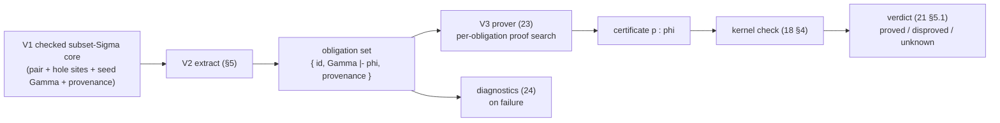

# Obligation generation

> Status: **V2 elaborated** (implementation-ready). Normative for what
> obligations are, how they arise, and the **extraction algorithm** that
> produces them. Contract for WS-V **V2** (the verification-condition extractor,
> second WP of the spine V1→V2→V3). **★★ (untrusted):** every obligation is
> discharged in V3 and the cert is **kernel-re-checked** (`../10-kernel/18
> §4`). A V2 bug never breaks **kernel** soundness — the kernel re-checks every
> *supplied* certificate, so a **spurious** or malformed obligation is at worst
> over-conservative (a false `unknown`). A **missed** proof component of a
> subset-Σ introduction cannot be silently accepted: the checked core pair
> needs a proof term, or an explicit postulate reachable by the honesty guard
> (`21 §5.4`). But a missed burden at another site, or an unrecorded postulate
> wrongly presented as discharged, can still make a false *verification*
> status. **Completeness of extraction remains the verification-soundness
> linchpin** (§2.5): kernel checking validates terms, not the assertion that
> every source burden was recorded at its site. Turns a V1-spec'd
> program into **proof obligations** — propositions in Ω, each in its local
> hypothesis context — that the prover (`23`) discharges and the kernel
> re-checks.

V2 is the bridge from V1's *syntax* (`requires`/`ensures`/refinements/goals,
`21`) to V3's proof search (`23`): it **consumes** V1's checked subset-Σ
pairs and explicit obligations (`21 §6`/§7) and **produces** the obligation
set keyed for the verdict projection (`21 §5`). The two load-bearing
properties (§the frame) are **completeness of extraction** — every spec
clause that bears a proof burden yields its obligation (the absent-clause
scan, §2.5) — and **honest provenance** — each obligation traces to
its source clause for diagnostics and the four-way status (`24`, `25`).

## 1. What an obligation is

An **obligation** is a triple

```
  ⟨ id , Γ ⊢ φ , provenance ⟩
```

- `id` — a **stable** identifier (for the protocol, `25`); stable across edits
  unrelated to the clause, so an agent can diff verification runs (`24 §6`).
- `Γ ⊢ φ` — a **goal proposition** `φ : Ω_ℓ` (`../10-kernel/12 §5`, `16 §1.1`)
  in a **local context** `Γ` of the hypotheses in scope at the point it arose.
- `provenance` — where it came from: the source span and the spec clause
  (`requires`/`ensures`/refinement/`prove`/`law`) responsible, used by
  diagnostics (`24`) and the verdict's epistemic projection (`21 §5`).

Discharging an obligation means producing a term `p` with `Γ ⊢ p : φ`, which the
kernel re-checks via `check(env, Γ, p, φ)` (`18 §4.5`). **An obligation is
exactly a typed hole** of type `φ` in context `Γ` (`24 §2`): obligation
generation *is* finding the holes V1's elaboration leaves where a proof is
required (`21 §6.5`), and proving = hole-filling. This unifies "obligation,"
"typed hole," and "visible postulate" — an open hole is admitted as a postulate
of `φ` and appears in `trusted_base()` (honesty guard, `21 §5.4`), so partial
verification (`21 §5`) is just leaving some holes unfilled.

Obligations are **independent**: each is a self-contained `Γ ⊢ φ`, provable in
any order / in parallel (the prover and the agent-team both exploit this, §6).

### 1.1 What V2 consumes from V1, and what it adds

V1 (`21 §7`) hands V2 a four-part interface: (1) the **kernel-checkable
core term** with refined parameter binders and `ensures` results as subset-Σ,
written preconditions as Π proof args, and a checked pair at each
introduction; (2) the **obligation-hole set** — one hole per emitted
refinement/`ensures`/`prove`/`law`-field proof burden, admitted as a
postulate until discharged; (3) each hole's **at-introduction `Γ`** —
written preconditions and refined-parameter projections with term evidence;
(4) **provenance** per hole.

V2 consumes the actual `Σ(B,ψ)` result value when `ensures` is present
(`21 §6.3`); the proof in its second component is kernel-checked or is an
applied, visible postulate. The subset's type is `Type (max ℓ_B ℓ_ψ)` by
`13 §4`, not an Ω-collapsed value. What V2 **adds** over V1's seed is
the **path-sensitive hypothesis accumulation** (§3) — the extraction algorithm's
context-building, layered onto each hole's seed `Γ` as it walks the elaborated
body — and the **body-as-motive induction plumbing** (§4). That context-building
is where V2 earns its ★★: V1 marks *where* the holes are; V2 computes *under
exactly what facts* each must be discharged.

## 2. Where obligations come from

Four sources, all arising during elaboration of the spec encoding (`21 §6`,
`../30-surface/39-elaboration.md`). Each is stated as the V1 clause-form it
consumes → the obligation(s) it emits.

### 2.1 Refinement introduction

Using `a : A` where `{ x : A | φ x }` is expected constructs the checked
subset pair `(a',π) : Σ(x:A).φ x` and records the introduction goal

```
  Γ ⊢ φ[a'/x]                             (the value satisfies the refinement)
```

The proof `π` is the first kernel-checked candidate among `tt`, context
variables, `Proj2 y` for a refined `y`, and the evidence terms for the
current path conditions. Otherwise `π` is the obligation hole: it is
declared with closed type `Π Γ. Π conds. Π hyps. φ[a'/x]` and **applied** to
actual terms for every argument (`21 §6.3`/§6.5). An open hole is a
postulate but still a checked proof term for the pair; hole discharge leaves
the pair intact. Obligation identity, provenance and discharge are unchanged.
The **reverse**, forgetful direction emits `Proj1` and no obligation (§2.5).
Neither direction is kernel subtyping or a conversion of Σ to its carrier.

### 2.2 Postcondition

A postcondition `ensures ψ` makes the **kernel subset-Σ result type**
`Σ(r:B).ψ` the body's expected type and **pushes it through the body's
structure** (§3/§4) — it is *not* a single obligation over a branchy body.
For multiple clauses, the second component is their Ω conjunction in one
Σ, with each clause's obligation identity and provenance retained (`21
§6.3`). The result type itself is the **motive** (§4), not a separate
verification-only reading; each body leaf introduces a checked pair:

- a **straight-line** body `b` introduces `(b,π)` and one obligation
  `Γ, Δ ⊢ ψ[b/result]` for one clause (the §2.1 introduction; `21 §6.3`);
- a **branchy** body (`match`/`if`/recursion) **splits per branch** via the
  actual Σ motive (§4, `39 §2.6`): each leaf introduces `(bₖ,πₖ)` with
  obligation `Γ, Γₖ ⊢ ψ[bₖ/result]` under that branch's evidenced path
  equations and induction hypotheses (§3, `14 §3`/§3.1/§3.2).

Splitting is **required**, not an optimization: a recursive function's
postcondition is only provable *by induction*, which is exactly the
per-constructor obligation-with-IH the motive yields (§4) — a single obligation
over the whole recursive body carries no induction hypothesis and cannot be
discharged. There is **no** separate over-the-whole-body postcondition
obligation; the postcondition is the result-type motive, realized per path.

### 2.3 Precondition discharge at call sites

Calling a function value whose type carries `requires φ` emits, **at the
call**, the proof-argument obligation below. A **written** `requires φ` is
visible in the function type's Π proof argument, not inferred from the
callee's spelling. A refined parameter is instead a Σ domain; a caller
with only `a:A` introduces the checked pair at the call (§2.1), including
through a higher-order function value. There is no hidden generated
`requires` binder for that refined domain:

```
  Γ_call ⊢ φ[ā/params]                    (the caller meets the precondition)
```

This **written** precondition is the caller's burden; inside `f`, its Π
proof argument is an **assumption with a term** in `Γ` (§3, §2.5), not a new
obligation. The caller of an `ensures` function receives a Σ result and may
use `Proj2` of that result as checked evidence; using it at bare `B` inserts
`Proj1`. The call does not discard the postcondition proof. A call through a
higher-order value obeys its checked Π domain, not a declaration-name lookup.

### 2.4 Partial-primitive application

A bare fixed-width `+`/`-`/`*` or an unrefined `/` (or `%`) on `Int` emits a
no-overflow / non-zero side-condition obligation at the operation site
(`../30-surface/35-numbers.md §3`, `../40-runtime/43-termination.md §2`) per the
`OQ-1a` partial-primitive discipline.

Standalone `prove name : φ` (`21 §3`) is the **degenerate** case: one obligation
`Γ_binders ⊢ φ` with no body. A `law` (`21 §3`) emits one obligation per field.

### 2.5 The absent-clause scan (what yields *no* obligation — and why)

Completeness is two-sided: the extractor must emit an obligation at **every**
burden-bearing site (§2.1–§2.4), and must **not** emit one where there is no
burden — but each no-emit position is **explicitly guarded with its reason**, so
a *missing* guard (a silently-dropped clause) is detectable. The hazard
is a missed **source** burden reading as "verified" despite checked
proof terms or other obligations at different sites; the discipline
is to enumerate the no-emit positions and name the guard for each:

**The exhaustiveness property (normative).** The traversal is **exhaustive by
construction**: over the *fixed* core `Term` set (`11 §1`), **every** form is
one of an emit site (§2.1–§2.4), a Γ-extension (§3), or a **guarded**
no-emit (below) — there is **no catch-all silent skip**. An unrecognized or
future core form with no rule is an **emit-or-error** (a visible build failure),
never a silent recurse-past. This is what makes "a missing clause is a visible
gap, not a silent drop" concrete: because completeness is backstopped by nothing
but this scan (the intro), a *new* burden-bearing construct cannot be silently
no-emitted — it has no guarded-skip rule, so it fails loudly until one is added.

1. **A refined *parameter*** `(x : {y:A|φ})` is a **subset-Σ binder**
   `x : Σ(y:A).φ` (`21 §6.3`). The body has checked proof evidence `Proj2 x`
   (§3). *Guard:* the binder itself is not a new value introduced at a
   refinement, so the definition site emits no introduction obligation.
   A caller passing `a:A` does introduce one (§2.1); no implicit proof
   binder or generated `requires` stands in for the Σ argument.
2. **A body `requires φ`** (a precondition, once inside the body) is **assumed,
   not re-obligated.** *Guard:* a precondition enters `Γ` at the top of the body
   (§3) and is never emitted as the function's own goal. (The caller already
   owes `φ`, §2.3.)
3. **A site whose discharging certificate is already present** — a `prove
   name : φ` given a term, or a refinement introduction supplied with a
   kernel-checked proof — yields **zero new open** obligations: its proof is
   the discharge (`18 §4.5`), not a silent skip of the clause. *Guard:* its
   certificate checks, and it reaches no open hole or unaccepted postulate
   through a transparent dependency (`21 §5.4`). A trivially true
   introduction is still recorded and discharged, never discarded by a
   triviality heuristic.
4. **The forgetful coercion** `{x:A|φ} ≤ A` is `Proj1` with **no new
   obligation** (§2.1). *Guard:* its direction forgets a checked proof;
   it does not equate Σ to A or coerce under a type former or binder.

**The completeness counter-rule (do not over-skip).** A clause that is
*trivially* true still yields its obligation — **a provable one, not no
obligation.** The extractor MUST NOT skip an "obviously true" `ensures`/
refinement: it emits the obligation and lets V3 discharge it trivially. *Guard:*
emission is keyed on the *clause's presence*, never on a triviality heuristic.
(This is the absent-clause discriminating property, acceptance §1: a real-burden
clause and a trivial clause both **emit** distinct obligations; neither yields
*no* obligation. A "skip the trivial ones" optimization is exactly how a clause
that was not actually trivial gets silently dropped.)

## 3. Hypothesis accumulation (the context Γ)

The power of the obligations comes from what is *assumed* in `Γ` at each point —
**path-sensitive**, like a verification-condition / refinement-type system, but
with hypotheses being **kernel propositions** (`: Ω`), not an external logic.
This is V2's novel work (§1.1). The extractor extends `Γ` as it walks the
elaborated body, by these rules — each a precise `Γ`-extension, stated
defensively so a dropped hypothesis (a too-weak `Γ`, → a false `unknown`) is the
visible failure, never a too-strong `Γ` (which could mask a real burden):

- **Preconditions and refined parameters.** Each **written** `requires φ`
  adds its Π proof argument `p : φ` to `Γ` in source order before the body
  (§2.3/§2.5). A refined parameter instead binds
  `x : Σ(y:A).φ y`; its hypothesis has the actual term `Proj2 x : φ(x.1)`.
  A written higher-order refined domain stays Σ, not a hidden proof binder;
  the caller constructs its checked argument pair (§2.1).
- **`let x := e`** (with `e : A`) adds `(x : A)` and, where `A` is informative,
  the equation `(_ : Eq A x e)` with term evidence `refl`: kernel `Let`
  substitutes the bound expression. Later obligations may rewrite using
  that checked equality, not an unrepresented Γ-only assumption.
- **`match` / case split.** Elaborated to an eliminator (`elim_D`, `14 §3`,
  `../30-surface/39 §2.6`). In each constructor branch `cₖ`, `Γ` gains the
  constructor's **fields** as binders **and** the **scrutinee equation**
  `eₖ : Eq A s (cₖ field̄)` (in Ω) — so in the `nil` branch you may assume
  `xs ≡ nil`. Its proof is bound by the branch's dependent convoy
  (`34 §3.6`), not invented by obligation extraction.
- **Conditionals.** `if c then … else …` (elaborated `elim_Bool`) binds
  `e_true : Eq Bool c true` or `e_false : Eq Bool c false` through the same
  convoy (motive `λ y. Eq Bool c y → T`, applied to `refl c`). Each branch
  receives its own **term** evidence before an obligation is closed.
- **Recursive evidence.** An SCT-checked self-call `f x'` has its declared
  subset-Σ result type; `Proj2 (f x')` is its postcondition evidence.
  An eliminator method's induction hypothesis at Σ motive `M zᵢ` supplies
  `Proj2 IHᵢ`. A recursive-call hypothesis without either term is refused,
  not used as unchecked evidence in a result pair.

Each obligation is therefore discharged under **exactly** the facts with
checked term evidence on its path. The `Γ` of an obligation emitted deep in
a branch is V1's seed `Γ` (§1.1) extended by evidenced hypotheses from the
body's root to that site; its closed hole is applied to those terms (`21
§6.5`). A proposition noted only by the extractor, with no core term,
**cannot** serve as a pair's proof.

## 4. Body-as-motive (verifying recursive and dependent functions)

For a function whose correctness is *inductive* — a recursive `fn`, or one
whose result type depends on a recursed argument — the obligation structure
follows the **body as the motive**, recovered from the elaborator's `match →
elim_D` compilation (`39 §2.6`); V2 does not synthesize an induction principle,
it **reads the eliminator the elaborator already built**:

- The function elaborates to an application of the relevant **eliminator**
  (`14 §3`) whose **kernel motive** `M` is the subset-Σ result type as a
  function of the recursed argument:
  `M z = Σ(r:B z).ψ(z,r)` for `ensures ψ` over scrutinee `z`.
- The kernel's **dependent** eliminator gives each constructor method the
  **induction hypothesis** as a parameter: in the `cₖ` method, every direct
  recursive field `zᵢ` carries `M zᵢ` (the motive already established for the
  sub-structure), while a field with nested recursive content carries the
  structurally lifted hypotheses `Lift_D(M, Aᵢ, zᵢ)` (`14 §3.2`). V2 adds the
  direct or lifted motive instances to `Γ` (§3) — so the obligation for a direct
  branch, or for every contained child of a nested branch, has "the
  postcondition holds for the recursive call" in scope. Its `Proj2` is the
  proof **term** consumed by a branch introduction. Direct self-calls
  already have a Σ result by their declared type, giving the distinct
  term `Proj2 (f x')` (§3). This is structural induction surfaced
  automatically, without Γ-only evidence.
- **Non-recursive** functions are the degenerate motive (no recursive fields ⇒
  no induction hypotheses); the same machinery covers both — the extractor does
  not special-case recursion.

So "prove this recursive function meets its spec" becomes "discharge the
per-constructor obligations, each with the recursive call's spec as a
hypothesis" — generated mechanically, no manual induction principle stated by
the user. (The eliminator's own totality is the kernel's concern — direct,
Π-bound, and nested structural positivity plus SCT, `14 §8`/`17 §4`; V2
consumes a well-formed eliminator, it does not re-check termination.)

## 5. The extraction algorithm

The extractor walks V1's checked core term **and its source-site/provenance
marks**, recording V1's typed obligations at burden sites (§2), threading
path-sensitive `Γ` **with evidence terms** (§3) and the kernel Σ
body-as-motive structure (§4). `Intro`/`FnDef` below denote marked sites in
that walk, not new kernel `Term` variants. An already recorded hole is
associated with its site, not minted a second time. The pseudocode is
**defensive**: every
burden-bearing position has an emit clause; every `Γ`-extending construct has a
recurse-under-extended-`Γ` clause; and every **no-emit** position is an explicit
guarded skip (§2.5), so a missing clause is a visible gap, not a silent drop.

```
extract(Γ, term, expectedTy) → ObligationSet:    -- checked core + V1 site/provenance marks
  obls := ∅
  case term/site of

  -- (§2.1) a marked introduction at subset-Σ expected type
  Intro(Pair(a, π), T) when whnf(T) = Σ(x:A).φ with φ : Ω:
        obls ∪= obligationAt(π, Γ ⊢ φ[a/x], prov(site))
        obls ∪= extract(Γ, a, A)             -- checked first component
        requireChecked(π, φ[a/x])             -- evidence OR applied typed hole

  -- (§2.2) a contracted function: the Σ result IS the motive
  FnDef(Δ, requires φ̄, ensures ψ̄, body, B):
        Γ' := Γ ⊕ Δ ⊕ { pᵢ : φᵢ | φᵢ ∈ φ̄ }  -- Δ may contain subset-Σ binders
        resultTy := Σ(r:B).(ψ₁ ∧ … ∧ ψₙ)    -- if no ensures, use B instead
        obls ∪= extract(Γ', body, resultTy)  -- per leaf; no extra whole-body goal

  -- (§2.3) a call: written requires only; subset arguments use Intro above
  App(f, ā) when hasWrittenRequires(typeOf(f)):
        for φᵢ ∈ writtenRequires(typeOf(f)):
           obls ∪= obligationAt(pᵢ, Γ ⊢ φᵢ[ā/params], prov(call))
        obls ∪= extractArgsAtDomains(Γ, ā, typeOf(f))

  -- (§2.4) a partial primitive
  Prim(op, ā) when isPartial(op):
        obls ∪= obligationAt(p, Γ ⊢ sideCond(op, ā), prov(op))
        obls ∪= extractArgs(Γ, ā)

  -- (§3) extend Γ with checked TERM evidence, then recurse
  Let(x, e, A, body):
        Γ' := Γ ⊕ (x:A) ⊕ (eq : Eq A x e, refl)
        obls ∪= extract(Γ, e, A) ∪ extract(Γ', body, expectedTy)
  Elim(M, methods, scrut, A):              -- M may be subset-Σ (§4)
        for (cₖ, branchₖ) ∈ methods:
           Γₖ := Γ ⊕ fields(cₖ)
                   ⊕ (eqₖ : Eq A scrut (cₖ fields(cₖ)), convoyEvidenceₖ)
                   ⊕ sigmaInductionHypotheses(M, cₖ, fields(cₖ))
           obls ∪= extract(Γₖ, branchₖ, M (cₖ fields(cₖ)))
  If(c, thn, els):                          -- elim_Bool, convoy evidence
        obls ∪= extract(Γ ⊕ (eq_t : Eq Bool c true, convoy_t), thn, expectedTy)
        obls ∪= extract(Γ ⊕ (eq_f : Eq Bool c false, convoy_f), els, expectedTy)

  -- (§2.5) guarded no-emit: type-directed projection, not Σ ≡ carrier
  Forget(Proj1 e : A):
        obls ∪= extract(Γ, e, Σ(x:A).φ)    -- no NEW forgetful obligation
  Var | Const | Lam | Pair(relevant) | Proj2(proof) | Type | …:
        recurse into immediate subterms; subset Pair above is NEVER skipped

  -- NO catch-all `_ => skip`: an unhandled site/form is an emit-or-error.
  return obls
```

- **Untrusted — but completeness is the verification-soundness linchpin.** A
  spurious obligation is over-conservative: every supplied certificate is
  kernel-checked (`18 §4`). A missing **subset proof term** is a core type
  error, and a hole hidden in a checked pair remains a visible postulate
  reached by the transitive guard (`21 §5.4`). Nonetheless a source burden
  can be skipped outside that pair, or recorded under the wrong provenance;
  the kernel does not prove extraction completeness. The **absent-clause scan
  (§2.5)** and exhaustive, no-silent-skip traversal ensure all source
  burdens appear before any claim is reported as proved.
- **Completeness target.** Every refinement/contract/goal use generates the
  obligations whose discharge (plus kernel checking) suffices for the spec to
  hold (acceptance §1). The absent-clause scan (§2.5) is the audit that no
  burden-bearing position is silently skipped.
- **Subset-Σ soundness.** `extract` reads V1's checked subset pairs and
  per-leaf `ensures` pairs, whose carrier stays relevant at
  `Type (max ℓ_A ℓ_φ)` (`13 §4`). It does not treat an Ω proof
  component as permission to collapse the carrier or skip an introduction.

## 6. Output and the V2→V3 interface

Obligation generation produces, per definition, the **ordered obligation set**
with contexts and provenance. This is the V2→V3 interface — the input to the
**classifier/prover** (`23`) and the verdict projection (`21 §5`):



- Each obligation maps to **one** proof attempt → **one** verdict (`21 §5.1`):
  `proved` (a certificate that `check`s), `disproved` (a countermodel), or
  `unknown` (an unfilled hole = a visible postulate). The set is keyed so the
  per-claim **epistemic status** (`21 §5.2`/§5.3) projects from its obligations'
  verdicts.
- A definition with an **empty** obligation set (or all discharged) is
  fully verified only if the checked proof terms also reach **no** open hole
  or unaccepted postulate through transparent dependencies (`21 §5.4`). One
  with open obligations is partially verified and carries typed holes in
  `trusted_base()`; another claim's `Proj2` may reach them transitively.
- The set's **serialization** is part of the protocol (`25`); V2 fixes the set's
  *shape* (the triple + ordering + provenance), `25` fixes its wire form.

V2 does **not** discharge obligations (V3) or re-check certificates
(the kernel, `18 §4`); it produces the set and hands it on.

## 7. Level-discipline reconcile

Per the standing directive, the level computations here are made explicit and
reconciled against `12`/`16 §1.1`:

- **Every obligation goal is in Ω.** `φ : Ω_ℓ` for some `ℓ` — it is a V1 spec
  proposition (`requires`/`ensures`/refinement-predicate/`prove`/`law`-field),
  each of which V1 `check`s at Ω (`21 §4`/§6.3). V2 forms no new props; it
  *substitutes into* and *collects* V1's, so goals stay in Ω by construction.
- **Substitution preserves Ω.** The postcondition goal `ψ[b/result]` and the
  refinement goal `φ[a/x]` substitute a term for a variable in an Ω-proposition;
  substitution preserves typing (`11 §5`), so the result is at the **same**
  `Ω_ℓ` — no level change to the **goal**.
- **Hypotheses are at their natural levels.** A `Γ`-entry is a data binder
  (`x : A : Type ℓ`), a subset-Σ binder at
  `Type (max ℓ_A ℓ_φ)`, a checked proof argument (`p : φ : Ω_ℓ`), or a
  path equation with a bound evidence term (`eq : Eq A s t : Ω_ℓ` for
  `A : Type ℓ`, `16 §2.1`). The direct, Π-abstracted or structurally
  lifted induction hypotheses (§4) are at the kernel motive's **actual
  subset-Σ** type; `Proj2 IH` supplies an Ω proof. They are not bare
  proposition assumptions manufactured by V2.
- **No new universes or formers.** V2 introduces none: the subset pair
  reuses kernel Σ, whose relevant carrier and Ω predicate land at
  `Type (max ℓ_A ℓ_φ)` (`13 §4`); Ω, Eq and eliminators retain their
  existing formation levels. This may be **higher** than the carrier
  level and has no implicit non-cumulative lift (`12 §2`/§3).

## 8. What WS-V must deliver here (V2)

The extractor: the obligation triple (§1) with stable ids + honest provenance;
emission at every burden site — refinement/postcondition/precondition/
partial-primitive (§2) — with the **absent-clause scan** (§2.5) auditing that no
burden is silently skipped and no trivial clause over-skipped; **path-sensitive
hypothesis accumulation** (§3); **body-as-motive** induction plumbing read from
the elaborator's `elim_D` (§4); the full **extraction algorithm** (§5); and the
**V2→V3 interface** (§6) keyed for the verdict projection, with checked
subset-Σ results and term evidence at every proof-carrying introduction.

Acceptance ties to **G2**: for a recursive function with an inductive
postcondition, the obligations + supplied proofs `check` in the kernel,
and removing a needed proof leaves a **precisely-located open hole** (an
`unknown`, visible in `trusted_base()`); a trivially-true clause yields its
provable obligation, not *no* obligation (§2.5); a refined parameter yields
a checked `Proj2` hypothesis with no spurious definition-site
obligation (§2.5), while its caller supplies a checked subset argument; and
non-spec programs yield
the **empty** obligation set with V1/V0 elaboration unchanged. Conformance:
`../../conformance/verify/obligations/`.
